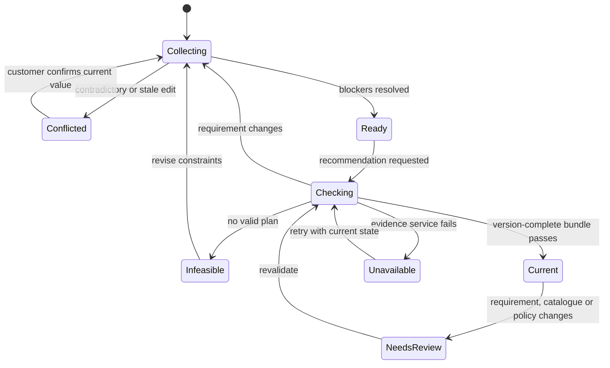

# Solution Design Specification: Northstar Space Planner

**Owner:** Designer  
**Design date:** 2026-08-11  
**Status:** READY FOR BUILD  
**Scope:** Founder-led v2 only. No v1 file was read as product authority or changed.

## 1. Inputs Actually Read

1. `founder-charter.md`
2. `research-led-authority.md`
3. `pipeline/run-config.md`
4. `agents/designer.md`
5. Accepted `handoffs/01-research-implementation-brief.md`
6. `evidence/decision-log.md`
7. `handoffs/README.md`

The accepted research is the authority for implementation method. This design
therefore strengthens the founder's outcome rather than preserving early,
unresearched interface assumptions. In particular, precise editing lives in 2D,
3D is a derived inspection view, and customer-visible claims require current
deterministic evidence.

## 2. Product Experience

Northstar is a conversational planning workspace for a person who wants to build
or upgrade a home gym without first becoming an equipment standards expert. The
customer talks naturally with **Mara**, sees each understood constraint appear in
an editable plan, and receives one coherent equipment proposal that has passed
current catalogue, compatibility, room-fit and budget checks.

The product should feel like planning alongside a knowledgeable retailer:

- conversation turns an uncertain idea into structured requirements;
- the visible plan makes the assistant accountable for what it understood;
- a precise room view makes spatial compromises inspectable;
- evidence and uncertainty are available without overwhelming beginners;
- the quote explains the whole package, not just the headline machine;
- no interface layer can silently overrule the canonical plan.

Northstar is an actual working application on first load, not a marketing page.

## 3. Design Principles

1. **Guide in chat; verify in the workspace.** Conversation is the primary
   guidance mechanism, while requirements, evidence, geometry and money remain
   visible and directly editable.
2. **One plan, many views.** Chat, summary, quote, 2D and 3D project the same
   versioned server state.
3. **Validity before persuasion.** Northstar never presents a recommendation as
   current until deterministic checks pass against the same version bundle.
4. **Say what is known.** Verified facts, Northstar judgement, assumptions,
   conflicts, stale results and missing information have distinct language.
5. **Make the useful choice.** Return one recommended plan and, only when it
   exposes a material trade-off, one validated alternative.
6. **Progressive technical depth.** Plain capability language is default.
   Detailed interfaces, gauges, holes, clearances and evidence are available on
   demand.
7. **Preserve agency.** Every captured requirement and placement can be changed
   without restarting the conversation.
8. **Accessible equivalence.** Dragging and WebGL are enhancements. Numeric,
   keyboard and textual controls complete the same task.
9. **Geometry is not certification.** "Fits" means the recorded room and encoded
   clearances pass. It does not mean an installation or exercise is safe.

## 4. Information Architecture

### 4.1 Global application shell

The 56 px top bar contains:

- Northstar wordmark and compact rack-line brand mark;
- segmented journey control: `Plan a gym` / `Upgrade equipment`;
- current plan status: `Collecting details`, `Ready to plan`, `Checking`,
  `Current`, `Needs review` or `Unavailable`;
- catalogue freshness control showing `Checked 14:32` and a refresh icon;
- `Start over` in an overflow menu.

It does not show internal words such as model, tool, API, row or Sheet.

### 4.2 Desktop layout, 1180 px and wider

Below the top bar, use a full-height three-column workspace:

| Region | Width | Contents |
|---|---:|---|
| Conversation | 340 px, resizable to 420 px | Mara header, messages, bounded choices, composer and progress |
| Room workspace | `minmax(520px, 1fr)` | 2D/3D segmented view, canvas toolbar, violations and selected-item controls |
| Plan inspector | 360 px, resizable to 440 px | Requirements, equipment, budget/quote and evidence tabs |

Columns are separated by 1 px rules, not floating section cards. The room canvas
uses the largest area. Conversation and inspector scroll independently; the top
bar and composer remain fixed. The inspector tabs are `Plan`, `Quote` and
`Details`. A selected item opens directly to its details without hiding the plan.

### 4.3 Medium layout, 768-1179 px

Use two columns: conversation at 320 px and room workspace for the remainder.
The persistent plan becomes a right-side sheet opened by the always-visible
`Plan and quote` button. A 48 px summary rail beneath the top bar always exposes
room size, budget usage, item count and current/invalid status. Direct edits in
the sheet update the same state and return focus to the invoking control.

### 4.4 Mobile layout, below 768 px

Use one task surface at a time with a fixed bottom navigation:

- `Chat`;
- `Plan`;
- `Room`;
- `Quote`.

A compact status strip stays above the navigation and shows room size, budget
position and validation status. Tapping a value opens its direct editor. The
chat composer stays above both strips. The `Room` screen defaults to 2D; 3D is a
segmented alternative. Selected-item controls appear in a bottom sheet occupying
no more than 55% of the viewport and can be dismissed without losing selection.

The mobile experience is sequential, not a squeezed desktop layout. Status
changes announce across tabs, and invalid fields receive a badge on the relevant
navigation item.

### 4.5 Information priority

1. Blocking question or current validation problem.
2. Current plan status and next available action.
3. Room and budget constraints.
4. Recommended equipment and placement.
5. Quote composition.
6. Detailed specification and provenance.

## 5. Visual Language

Northstar should feel capable, approachable and technical without resembling an
industrial admin dashboard.

- Background: soft white `#F7F9F8`; work surfaces `#FFFFFF`.
- Primary text: graphite `#1B2427`; secondary text `#526064`.
- Brand/action: deep teal `#087F73` with white text at accessible contrast.
- Selection/accent: warm coral `#DE674B`, used sparingly.
- Valid: green `#247A4A`; caution: ochre `#936119`; invalid: red `#B42318`.
- Unknown/stale: neutral violet-grey `#665D76`, paired with text/icon.
- Borders: `#D8E0DE`. No gradients, decorative orbs or oversized hero type.
- Type: Inter when bundled, otherwise `system-ui`. Body 15-16 px, compact labels
  12-13 px, panel headings 18-20 px. Letter spacing is zero.
- Corners: 4 px for inputs and panels, 6 px maximum for repeated product rows.
- Use Lucide icons for edit, undo, redo, rotate, lock, unlock, remove, refresh,
  fit view, zoom, walls, evidence and warnings. Unfamiliar icons need tooltips.

Plan equipment is visually recognisable through original Northstar procedural
shapes. Status is never conveyed by colour alone; icon, label and pattern agree.

## 6. Assistant Persona and Conversation

### 6.1 Persona

**Mara Quinn, Northstar equipment planner**

Mara is warm, calm and practical. She sounds like an experienced equipment
specialist who enjoys helping people make sensible choices, not a salesperson
forcing an upsell. She uses Irish/European metric language and EUR, explains one
technical term when it becomes relevant, and adapts detail to experience level.

Mara:

- acknowledges useful information without repeating the whole state;
- accepts several facts from one message and asks only what remains important;
- gently challenges impossible combinations;
- explains the reason for a recommendation in customer language;
- never describes internal calls, data rows or model behaviour;
- never says "safe", "certified", or "guaranteed fit" for a room or installation;
- does not fill conversational silence with unsupported speculation.

### 6.2 Openings

Initial message:

> Hi, I'm Mara. I can help plan a new training space or find upgrades for
> equipment you already own. Which are you working on?

Bounded choices are `Plan a new space` and `Upgrade equipment`. The composer
remains active for free text.

New-space continuation:

> Great. What are the room's length, width and ceiling height? Metres or
> centimetres are both fine.

Upgrade continuation:

> Tell me the rack or equipment you have. A Northstar model name is ideal, but
> you can also enter another item and its measured footprint.

### 6.3 Turn choreography

For a normal discovery turn:

1. Parse all candidate facts from the customer's message.
2. Submit a version-checked requirement patch.
3. Reflect accepted facts in the visible plan immediately.
4. If a fact conflicts or is ambiguous, ask for that correction first.
5. Otherwise request the highest-priority blocking or high-information field.
6. Ask one question, except tightly coupled dimensions or door width/location.

The message pattern is: brief acknowledgement, material implication if useful,
then one question. Do not recite every captured value because the plan already
shows them.

Bounded quick choices are suitable for journey, experience, controlled goals,
yes/no obstruction, mounting permission and over-budget consent. Product names,
constraints and questions remain free text. A customer can always type instead.

### 6.4 Beginner and experienced language

- Beginner: "A half rack gives you guided barbell support and leaves more room
  than the full rack." Technical details remain behind `View specifications`.
- Experienced: "The N4 half rack uses the 75 mm, 17 mm Northstar interface.
  I checked this attachment against the recorded N4 generation."
- Experience changes explanation depth, never validation rules.
- Do not ask an experienced user questions whose answers are already explicit in
  their terminology. Do not assume a beginner knows rack ecosystems or hardware.

### 6.5 Corrections and conflicts

Chat correction:

> Got it. I've changed the ceiling height to 2.25 m. The previous layout now
> needs checking again because its rack was 2.30 m high.

Direct edit:

- save the accepted value to canonical state;
- add a quiet system entry in chat, e.g. `Ceiling height changed to 2.25 m`;
- mark affected outputs `Needs review`;
- Mara uses the new value on the next turn.

If a delayed chat update loses a version race:

> Your plan changed while I was checking that. I've kept the newer value:
> 2.25 m. Shall I continue with it?

The newer canonical value wins. The delayed value is never applied silently.

### 6.6 Recommendation transition

When readiness passes:

> I have enough to build a plan. I'll check current products, room fit,
> compatibility and the complete cost before I recommend anything.

Show one visible progress row with changing customer-facing stages:
`Checking current products`, `Testing room layouts`, `Building the quote`.
It is an honest operation status, not fake typing. The chat composer remains
available but submitting a mutation cancels or stales the in-flight result.

After validation:

> This plan covers your main strength goal, keeps a 1.4 x 1.8 m open area, and
> stays EUR 86 under your budget. The rack and bench fit the recorded room and
> encoded clearances. Here is the compromise: I chose the compact bike instead
> of a rower because the rower's use area would cross the door swing.

### 6.7 Budget permission

No plan under the hard cap:

> I cannot make the requested combination fit within EUR 1,500. The least-cost
> validated version is EUR 1,642, mainly because the rack also requires a bar,
> plates and flooring. I can show that EUR 142-over comparison, or we can reduce
> the plan. Which would you prefer?

Only `Show EUR 142-over comparison` records consent. The over-budget plan is
visually separated, labelled `Comparison, not within your budget`, and never
replaces the current in-budget plan without an explicit customer choice.

### 6.8 Impossible, missing and stale cases

Impossible room:

> The 2,080 mm rack does not fit the recorded 1,980 mm ceiling. I have not placed
> it. I can check a lower rack or revise the ceiling measurement.

Missing fact:

> The deployed depth is not provided, so I cannot validate this rack in the room
> or estimate it. I can compare products with complete measurements instead.

Dimensional-only compatibility:

> The recorded dimensions match the checks we can perform, but Northstar has no
> approved compatibility relationship for these products.

Expired commercial data:

> I can keep your room plan, but I cannot provide a current quote until price and
> availability can be refreshed. Last checked: 14:32.

## 7. Canonical State Model

### 7.1 Authority

The server owns one `PlanState`. Chat history, React state, Konva nodes and
Three.js objects are projections and may not become sources of product truth.
Every derived output is current only when all of its version references equal
the active plan versions.

### 7.2 Required shape

```text
PlanState
  plan_id
  journey_type
  requirements_version
  catalogue_snapshot_id
  compatibility_policy_version
  geometry_policy_version
  quote_policy_version
  status

  requirements
    room { width_mm, length_mm, height_mm, flooring_build_up_mm }
    doors[]
    obstructions[]
    goals[]
    original_goal_text
    experience
    intended_users[]
    priorities[]
    budget_cents
    mounting_permission
    noise_impact_preference

  existing_equipment[]
    identity_kind: northstar | governed_reference | manual
    variant_id/reference_id
    manual_footprint
    evidence_status

  budget_consent
    overrun_allowed
    maximum_authorised_overrun_cents
    consented_at

  selected_items[]
  placements[]
    placement_id, variant_id, x_mm, z_mm, rotation_deg, locked
    geometry_version, validation_status, violations[]

  recommendation
    status, candidate_ids, exclusions[], explanation_facts[]
    requirements_version, catalogue_snapshot_id

  compatibility_results[]
  layout
    layout_id, status, placements[], unplaced_items[], score_factors[]
    requirements_version, catalogue_snapshot_id, policy_version

  quote
    quote_id, status, lines[], subtotal_cents, delivery_cents
    installation_cents, unknown_charges[], grand_total_cents
    within_budget, overrun_cents, observed_at
    requirements_version, catalogue_snapshot_id, policy_version

  source_status
    catalogue_freshness, observed_at, refresh_error
  event_version
```

Every requirement field also stores `value`, `unit`, `status`, `source`,
`last_changed_at` and `last_changed_by`. Unknown money and facts are null plus a
status, never zero or an empty string.

Transient UI state such as open tab, zoom, camera position, hovered item and
draft text stays client-side. Selected item is client-side but synchronised
between 2D, 3D, plan rows and details.

### 7.3 Mutating events

| Event | Canonical effect | Required downstream action |
|---|---|---|
| `CHAT_REQUIREMENTS_PROPOSED` | Applies validated patches with expected version | Recompute blockers; stale affected outputs |
| `FIELD_EDITED` | Changes one or more direct fields | Same as chat; add quiet transcript event |
| `JOURNEY_CHANGED` | Changes journey and preserves still-relevant facts | Confirm destructive removals; recompute blockers |
| `ITEM_ADDED` / `ITEM_REMOVED` | Changes selected set | Recheck compatibility, layout and quote |
| `PLACEMENT_DRAGGED` | Proposes X/Z | Validate before commit; keep invalid preview if rejected |
| `PLACEMENT_NUDGED` | Proposes bounded X/Z delta | Validate before commit |
| `PLACEMENT_POSITION_SET` | Proposes numeric X/Z | Validate before commit |
| `PLACEMENT_ROTATED` | Adds 90 degrees modulo 360 | Validate before commit |
| `PLACEMENT_LOCKED` / `UNLOCKED` | Changes lock flag | Regeneration must preserve all locks |
| `LAYOUT_REGENERATED` | Requests deterministic layout with seed | Validate locks, then publish current layout |
| `CATALOGUE_REFRESHED` | Changes snapshot only after atomic valid publish | Mark candidates, compatibility, layout and quote stale |
| `BUDGET_OVERRUN_CONSENTED` | Records exact consent scope | Permit separate comparison only |
| `ALTERNATIVE_SELECTED` | Replaces selected set after current validation | Publish placement/quote bundle atomically |
| `UNDO_REQUESTED` | Applies inverse of last reversible accepted event | Revalidate as a new version |
| `REDO_REQUESTED` | Reapplies last undone event if no intervening mutation | Revalidate as a new version |
| `PLAN_RESET` | Creates fresh anonymous plan after confirmation | Clear transcript and projections |

Maintain at least 20 reversible accepted customer mutations per anonymous
session. Catalogue refreshes, failed proposals and assistant messages are not
undo steps. Undo never restores an expired catalogue claim as current.

### 7.4 Conflict and invalid mutation behaviour

All mutations carry `expected_version`. A stale mutation receives
`STATE_CONFLICT` plus current state. The client:

1. retains any unsent draft;
2. replaces visible canonical fields with the server values;
3. announces the conflict;
4. offers `Review change`, never blind overwrite.

For a drag, rotation or numeric move, run the shared deterministic geometry
kernel locally for immediate preview and send the proposal to the server. Until
accepted, render the proposed item as a patterned red preview at the attempted
position and retain the last accepted placement as a faint outline. On rejection,
focus the violation summary. With reduced motion, return instantly; otherwise
animate back in no more than 150 ms.

When a room, product or policy edit makes a previously accepted plan invalid,
retain the placements so the problem can be seen. Label the bundle `Needs
review`, show exact violations, disable `Use this quote`, and offer `Recalculate
unlocked items`. Locked conflicts are never repaired by moving locked items.

### 7.5 Validation lifecycle

The fixed revalidation order is:

1. validate and version requirements;
2. determine blockers and recommendation readiness;
3. acquire a current or policy-allowed catalogue snapshot;
4. search and rank eligible product sets;
5. validate all required compatibility relations and conditions;
6. validate locked placements;
7. generate and validate room layout;
8. calculate the itemised quote;
9. assemble a version-complete validation bundle;
10. allow Mara to explain only that bundle.



## 8. New-Space Journey

1. **Choose journey.** Mara asks the opening question. Journey appears in the
   plan immediately.
2. **Record room.** Customer gives L/W/H naturally. The plan converts to metres
   for display and integer mm internally, echoes the values, then asks about
   doors/fixed obstructions. `Add door` and `Add obstruction` provide precise
   direct entry where chat would be cumbersome.
3. **Understand training.** Capture free-text goals and controlled capabilities.
   Ask one conditional question only when it changes equipment choice, such as
   whether barbell progression, cardio modality, open floor or low impact matters.
4. **Adapt to user.** Record experience and relevant users. Ask height/weight
   only when a documented limit or movement-height check requires it.
5. **Understand constraints.** Capture existing equipment, ranked priorities,
   all-in budget, mounting permission when relevant, and noise/impact sensitivity
   when relevant.
6. **Review readiness.** The plan highlights confirmed fields and unresolved
   blockers. Customer can edit any value before planning.
7. **Build plan.** Current catalogue, compatibility, layout and quote stages are
   shown. No product prose appears before validation.
8. **Inspect recommendation.** Show the recommendation reason, one principal
   compromise, preserved open-floor area, validation status and budget position.
9. **Adjust layout.** Customer selects, drags, rotates, nudges or locks items in
   2D. Each accepted change updates 3D and quote status. `Recalculate unlocked
   items` preserves locks.
10. **Explore alternative.** Show at most one alternative only when it offers a
    material difference, with a two-column delta rather than a second product grid.
11. **Review quote and evidence.** Itemised package includes required adapters,
    bar/plates, flooring, accessories and delivery status. Customer can inspect
    sources and assumptions.

For a beginner, Mara emphasises capability, versatility and why accessories are
needed. For an experienced user, she can surface exact interface, load type,
clearance and construction fields. Both receive the same validated plan.

## 9. Upgrade Journey

1. **Identify the host.** Search Northstar models by name/SKU, or governed
   reference models by exact identity. A selected result shows generation and
   key interface facts for confirmation.
2. **Manual fallback.** If identity is unavailable, collect name, measured width,
   depth and height. Label it `Manual footprint only`. It may occupy room space
   but cannot host approved attachment claims.
3. **Ask the desired outcome.** Capture the capability or named attachment and
   budget. Compatibility-only questions may be answered before room completion,
   but no room plan is recommended until spatial blockers are resolved.
4. **Evaluate relationships.** Results are grouped by state. Default results show
   explicitly compatible and compatible-with-condition options. `Show other
   checks` reveals dimensional-only, incompatible and insufficient states for
   explanation, not purchase recommendation.
5. **Resolve conditions.** A required adapter, stabiliser, anchoring or generation
   condition is listed before selection. Required sellable items are added to the
   quote automatically and visibly.
6. **Explain rejection.** Name exact failed constraints in plain language, with
   technical values in details. Suggest only a validated alternative.
7. **Place and quote.** Once room requirements are ready, add host and upgrade to
   the shared planner, validate clearances, and construct the whole quote.

Compatibility labels and actions:

| State | Customer label | Primary action |
|---|---|---|
| `explicitly_compatible` | Approved for these versions | Add to plan |
| `compatible_with_condition` | Approved with requirement | Review requirement |
| `dimensionally_matching_but_unapproved` | Dimensions match; not approved | View evidence |
| `incompatible` | Does not fit this equipment | See exact reason |
| `insufficient_information` | Cannot validate with current information | Add details / choose known model |

Only the first two states can enter a valid recommended plan, and the conditional
state requires all named conditions to be satisfied.

## 10. Component Inventory and Ownership

| Component | Behaviour and visible states | Data owner |
|---|---|---|
| App status bar | Journey, plan status, freshness, reset | Canonical status plus source status |
| Mara conversation | Messages, quick choices, honest progress, retry | Conversation projection; facts from tools |
| Composer | Free text, send, cancel current check | Transient draft |
| Requirements summary | View/edit fields, blockers, source of change | Canonical requirements |
| Equipment plan list | Selected items, reasons, status, remove/select | Canonical selected items |
| Recommendation header | Current/stale/invalid, rationale and compromise | Validation bundle |
| Alternative comparison | One material delta and explicit choose action | Validated alternative |
| 2D planner | Precise placement and interaction | Canonical room/placements |
| Placement inspector | X/Z, rotation, lock, remove, violations | Canonical placement plus draft proposal |
| 3D view | Read-only spatial inspection and selection | Same room/placements |
| Violation summary | Exact reason, involved items, required/available values | Geometry result |
| Compatibility panel | Five-state result, conditions, reasons, evidence | Compatibility result |
| Product datasheet | Specs, statuses, sources, date, unknown/conflict | Catalogue snapshot/evidence |
| Quote | Lines, reasons, totals, unknowns, budget | Current quote service result |
| Budget meter | Spent/headroom/shortfall; consent state | Requirements plus quote |
| Textual plan table | Accessible placement and status equivalent | Canonical placements |
| Toast/live region | Brief operation result; never sole error location | Event result |

## 11. Product, Evidence and Quote Presentation

### 11.1 Product rows and datasheet

A product result is a compact row with recognisable thumbnail, product name,
configuration, price status, stock state, footprint and one relevant capability.
It is not a decorative card. `View details` opens the inspector with:

- configuration and generation;
- physical and operating dimensions as separate groups;
- anchoring and installation requirements;
- declared load with its exact load type;
- interface fields where applicable;
- capability/suitability;
- evidence status beside each critical field;
- source title, link and checked date;
- missing and conflicting values written explicitly.

Never display a blank critical field. Use `Not provided`, `Sources disagree`,
`Northstar planning assumption` or `Not yet researched`.

### 11.2 Trust vocabulary

| Status | Label | Presentation |
|---|---|---|
| Verified source fact | `Source checked` | Document-check icon; source/date in details |
| Northstar recommendation | `Why it suits this plan` | Compass icon; evidence factors listed |
| Planning assumption | `Northstar planning assumption` | Ruler icon and patterned ochre treatment |
| Not provided | `Not provided` | Open-circle icon; no numeric substitute |
| Conflicting | `Sources disagree` | Split-arrows icon; validation blocked |
| Stale | `Needs refreshing` | Clock icon and last checked time |
| Invalid | `Does not pass current checks` | Alert icon and exact reason |

### 11.3 Quote

The quote is organised into `Core equipment`, `Required for this setup`,
`Flooring and room`, `Delivery/installation` and `Optional`. Every line shows:

- item/SKU and quantity;
- why it is included;
- integer-cent-derived unit price and line total;
- current, stale or unknown commercial status;
- remove action only when removal does not invalidate the plan.

Required adapters and stabilisers cannot be hidden in optional lines. Unknown
delivery or installation is shown as `Not currently available` and prevents a
claim that the grand total is complete. A genuine EUR 0 charge is `Included,
EUR 0.00` and remains distinct from unknown.

The budget summary shows total, maximum, headroom or exact shortfall and quote
observation time. Over-budget comparison uses a separate bordered band with the
consented excess and benefit. It cannot visually masquerade as in budget.

## 12. Editable Konva 2D Planner

### 12.1 Coordinate and scale

- North is the top of the canvas; west is left.
- X increases west to east. Z increases north to south.
- Room origin `(0,0)` is the north-west inside floor corner.
- Canonical values are integer mm. Pixels are calculated from viewport, zoom and
  pan only.
- `Fit room` chooses a scale leaving at least 24 px canvas padding.
- Minor grid represents 100 mm when legible; major grid represents 500 mm.
  Grid labels adapt by zoom without changing geometry.
- Optional snapping defaults on at 50 mm. Holding Alt temporarily disables it.
  Snapping never implies validity.

### 12.2 Layers, back to front

1. room fill, boundary and dimension lines;
2. grid;
3. door swings and fixed obstructions;
4. soft planning zones with labelled dotted pattern;
5. hard operating, loading and movement zones with dashed outlines;
6. product footprints and recognisable top silhouettes;
7. selection outline, lock icon and rotation handle;
8. attempted invalid preview and violation connectors;
9. non-interactive labels.

Users can toggle `Operating zones`, `Planning buffers`, `Dimensions` and `Grid`.
Turning off a layer hides visual detail only; validation remains active.

### 12.3 Toolbar and direct interaction

Stable 40 x 40 px icon controls: select, pan, undo, redo, zoom out, zoom in, fit
room, reset view and layers. Destructive remove is in the selected-item inspector,
not the main toolbar. Tooltips and accessible names are mandatory.

- Click/tap selects one item and synchronises plan row, 3D highlight and details.
- Drag proposes X/Z and displays live zone intersections.
- Rotation is exactly 90 degrees per action for MVP.
- Lock prevents auto-layout movement but not validation.
- `Recalculate unlocked items` is a text command beside the layout status.
- Pan requires pan mode or Space+drag so item drag is unambiguous.
- Wheel/pinch zoom centres on pointer and is clamped from full-room view to useful
  detail. Browser page zoom must not be blocked.

The DOM inspector always provides X and Z number inputs in metres with 10 mm
precision, 50 mm nudge buttons, rotate, lock/unlock and remove. Validation
messages identify the item and reason, for example:

> Rower use area overlaps the door swing by 320 mm.

### 12.4 Invalid and locked states

- Invalid attempt: red diagonal pattern, alert icon and exact text. Last accepted
  position remains faintly visible until rejection resolves.
- Existing invalid placement after a room edit: item remains at canonical
  coordinates with red outline and status badge; quote is stale.
- Locked item: solid lock icon and heavier outline. Dragging is disabled until
  unlock.
- Conflicting locked items: both use numbered violation markers; neither moves;
  `Recalculate` is disabled until the customer unlocks/moves/removes one or
  restores the prior room.
- Missing geometry: item appears in `Unplaced items`, never as a guessed shape.
- Manual footprint: hatch fill plus `Footprint only` label; no operating-area pass.

### 12.5 Text equivalent

Below the canvas in DOM, provide a sortable placement table:

| Item | Position | Rotation | Lock | Fit status | Action |
|---|---|---:|---|---|---|

Each position is announced in human terms, e.g. "850 mm from west wall, 420 mm
from north wall." The table exposes the same select, nudge, rotate, lock and
remove commands. A concise screen-reader room summary reports room dimensions,
item count, open-floor estimate, current violations and unplaced items.

## 13. Derived Three.js View

3D is a useful read-only spatial inspection surface, not an independent editor.

### 13.1 Shared scene contract

- Use the same room origin, X/Z positions, Y vertical axis and rotation values.
- Convert mm to scene units at one documented boundary, e.g. 1000 mm = 1 unit.
- Product dimensions and collision envelopes come from canonical geometry, not
  Three.js bounding boxes.
- Selection in 3D may highlight an item and open details, but cannot move, rotate
  or resize it.

### 13.2 Scene design

- Neutral light floor with 500 mm reference markings.
- Rear and side walls generated from room dimensions; front wall hidden by
  default. `Walls` cycles front hidden / half height / all walls.
- Soft ambient light plus one directional light; no dramatic shadows that hide
  geometry.
- Original parametric silhouettes: rack uprights/crossmembers, bench pad/frame,
  rower rail/seat/flywheel, bike frame/flywheel, bar sleeves/discs, dumbbell
  blocks/handles and storage frames.
- Use Northstar category colours sparingly while preserving material contrast.
- Hard violations show a red outline and numbered marker matching the DOM list.
  Optional zone overlay can be toggled; the 2D view remains the precise reference.

Orbit, zoom and pan are available with `Reset view` and `Fit room`. On first
render and after room size changes, frame the full room with a hint of wall and
all placed items. Preserve customer camera changes until reset or room resize.
Synchronise CSS size, renderer buffer and camera aspect after container changes.

### 13.3 Loading and fallback

Show a fixed-size skeleton labelled `Preparing room view` while modules and
procedural models load. If the container is hidden, initialise or resize when it
becomes visible. On WebGL absence, context loss or rendering error, replace the
canvas with:

> 3D view is unavailable on this device. Your editable 2D plan and room details
> are still available.

Offer `Return to 2D`. Chat, planning, validation and quote continue. Never show a
blank black canvas as a successful state.

## 14. Responsive and Accessible Behaviour

### 14.1 Keyboard and focus

- All controls use semantic buttons, inputs, tabs and tables.
- Logical focus order is top bar, active task surface, persistent summary,
  navigation.
- Opening a side/bottom sheet moves focus to its heading; closing returns focus.
- After an invalid placement, focus moves to its inline violation summary, not a
  disappearing toast.
- Canvas selection can be reached through the placement table. Arrow nudge is
  available when the selected item control has focus; Shift+Arrow uses 100 mm,
  Arrow uses 50 mm. Keys do not hijack the page outside that control.
- Escape cancels an uncommitted placement proposal or closes the top overlay.
- Undo/redo buttons have keyboard shortcuts only as enhancements.

### 14.2 Announcements and meaning

- Use a polite `aria-live` region for accepted edits and completed checks.
- Use assertive announcement only when an action failed and requires correction.
- Typing/progress text is available to screen readers but rate-limited to stage
  changes.
- Every visual violation has a text reason with involved item IDs/names and
  required/available values.
- Patterns, icons and labels accompany all status colours.

### 14.3 Touch, text and motion

- Minimum touch target is 44 x 44 CSS px with at least 8 px between destructive
  and primary actions.
- Mobile canvases do not trap vertical page scroll unless a deliberate item drag
  or pan has begun.
- Text wraps; no heading or button depends on viewport-scaled font size.
- Tables become labelled definition rows on narrow screens, not clipped columns.
- Under `prefers-reduced-motion`, disable return animations, camera tweening and
  nonessential transitions.
- Maintain WCAG 2.2 AA contrast for text and control states.

## 15. Empty, Loading, Failure and Recovery States

| Condition | Visible response | Available recovery |
|---|---|---|
| New anonymous plan | Mara opening plus empty room placeholder and editable unset fields | Choose/type journey |
| Requirements incomplete | Missing fields marked `Needed to plan`, no fake recommendations | Answer in chat or edit directly |
| Checking | Honest stage row; prior current plan remains visible but labelled if stale | Continue reading; new mutation cancels/stales result |
| No feasible plan | Exact hard constraints and least disruptive revision choices | Edit room/goals/budget; consent to exact overrun |
| Invalid manual placement | Attempt preview, last valid outline and reason | Adjust, cancel or use numeric controls |
| Locked conflict | Both items numbered; no automatic movement | Unlock/move/remove or undo |
| Missing critical geometry | Candidate cannot be placed; no guessed rectangle | Choose complete item or await data correction |
| Compatibility unknown | `Cannot validate` with missing fields | Select known host/reference; add governed details |
| Dimensional-only | Non-approval wording; no add-to-valid-plan action | View evidence or select approved alternative |
| Catalogue first load fails | No catalogue claims; existing unsourced shell only | Retry; direct requirement collection remains |
| Refresh fails inside stale window | Last-known-good items labelled with checked time | Retry; plan may continue under policy |
| Commercial data expired | Layout remains; prices/stock and current quote unavailable | Refresh; do not claim total/current stock |
| Candidate snapshot invalid | Keep last-known-good; customer sees freshness state, not row errors | Retry after governed correction |
| Language service unavailable | Direct requirements, catalogue, planner and quote controls remain | Retry conversation; no scripted fake answer |
| Validation service timeout | Claim remains unvalidated | Retry; never convert to positive |
| State conflict | Current value wins; conflicting proposal shown for review | Accept current or submit deliberate new edit |
| 3D unavailable | Clear message and functional 2D/text plan | Return to 2D, retry 3D |
| Offline | Preserve visible session state as read-only; mark all network claims unavailable | Reconnect and re-fetch canonical state |
| Unexpected error | Stable shell with reference ID; no secrets/internal trace | Retry action or start fresh plan |

Customer errors never expose stack traces, prompts, service names, raw data rows
or credentials.

## 16. Exact Maker Acceptance Criteria

### 16.1 Application and state

- **DES-STATE-01:** Chat extraction and direct editing of the same field both
  mutate one server `PlanState` and increment `requirements_version`.
- **DES-STATE-02:** A stale `expected_version` is rejected and cannot overwrite a
  newer value.
- **DES-STATE-03:** Any relevant accepted mutation immediately marks dependent
  recommendation, compatibility, layout and quote results stale.
- **DES-STATE-04:** A recommendation displays `Current` only when its complete
  requirements, snapshot and policy version bundle matches active state.
- **DES-STATE-05:** Undo applies a new, version-checked inverse event and triggers
  revalidation; it does not revive stale commercial claims.

### 16.2 Conversation

- **DES-CONV-01:** First load presents Mara and accepts both bounded journey
  choices and free text.
- **DES-CONV-02:** One message containing room, goal and budget captures every
  valid fact and does not ask for those values again.
- **DES-CONV-03:** Normal turns ask one high-information question; only coupled
  dimensions may be grouped.
- **DES-CONV-04:** Beginner and experienced fixtures receive different language
  depth but identical deterministic results.
- **DES-CONV-05:** Internal terms `tool`, `API`, `model`, `row` and `Sheet` never
  appear in customer replies or visible customer errors.
- **DES-CONV-06:** Model output cannot set fit, compatibility, stock, price,
  totals or validation status without current deterministic outputs.
- **DES-CONV-07:** Checking displays honest customer-facing operation stages and
  never leaves the interface looking frozen.

### 16.3 Journeys and recommendation

- **DES-NEW-01:** The 4.0 x 3.0 x 2.4 m, strength, EUR 2,500 fixture completes
  discovery, produces one valid plan, quote at/below budget and synchronised views.
- **DES-NEW-02:** Directly editing ceiling height after recommendation visibly
  stales the plan and revalidation rejects an over-height rack with exact values.
- **DES-UPG-01:** Exact approved host and generation can add an explicitly
  compatible attachment.
- **DES-UPG-02:** Adapter-required equipment enters a valid plan only when the
  named adapter/condition is satisfied and quoted.
- **DES-UPG-03:** Manual external equipment remains footprint-only and never
  receives an approved compatibility result.
- **DES-REC-01:** Recommendation output contains one recommended plan and no more
  than one materially distinct validated alternative.
- **DES-REC-02:** No feasible under-budget plan prompts revision or exact overrun
  consent; budget never increases silently.

### 16.4 Catalogue, evidence and compatibility

- **DES-DATA-01:** A valid live catalogue change produces a new snapshot ID and
  changes the governed customer answer after refresh.
- **DES-DATA-02:** Unknown, conflicting, assumption, not-applicable and stale
  facts render as distinct text states; none becomes zero or a guessed value.
- **DES-DATA-03:** Product details expose relevant source title/link and checked
  date for customer-critical facts.
- **DES-DATA-04:** An invalid candidate snapshot cannot partially replace the
  last-known-good snapshot.
- **DES-COMP-01:** All five compatibility states have distinct labels, reason
  text and allowed actions.
- **DES-COMP-02:** Matching dimensions without an approval relationship displays
  `Dimensions match; not approved` and cannot enter a valid recommended plan.
- **DES-COMP-03:** Generation, hardware, pin, spacing and obstruction failures
  identify exact reason codes and customer language.

### 16.5 Quote and budget

- **DES-QUOTE-01:** All quote arithmetic uses integer cents and formats EUR only
  at presentation boundaries.
- **DES-QUOTE-02:** Required adapters, stabilisers, bar/plates, selected flooring
  and known delivery/installation appear as itemised lines with inclusion reasons.
- **DES-QUOTE-03:** Unknown delivery is labelled unknown and is never rendered
  as EUR 0.00.
- **DES-QUOTE-04:** A genuine included EUR 0 line remains distinguishable from
  unknown.
- **DES-QUOTE-05:** Over-budget comparison shows exact overrun, value gained and
  recorded consent in a separate visual treatment.

### 16.6 Precise 2D

- **DES-2D-01:** 2D uses canonical integer-mm placements; zoom and pan never
  mutate geometry.
- **DES-2D-02:** Drag, 90-degree rotate, lock/unlock, remove, 50 mm nudge and
  numeric X/Z all work with mouse, touch where applicable and DOM controls.
- **DES-2D-03:** Static footprint, hard operating zones, door swing and soft
  planning buffers can be visually distinguished and have text equivalents.
- **DES-2D-04:** A rower whose body fits but use envelope crosses a door is
  rejected with exact overlap reason.
- **DES-2D-05:** An invalid edit shows the attempted position and last accepted
  position; server rejection does not corrupt canonical coordinates.
- **DES-2D-06:** Two conflicting locked items remain fixed and receive an exact
  resolvable conflict.
- **DES-2D-07:** Recalculation moves no locked item and is reproducible for the
  same inputs, versions and seed.
- **DES-2D-08:** The DOM placement table allows completion of every drag-based
  action without using the canvas.

### 16.7 Derived 3D

- **DES-3D-01:** 3D renders room and recognisable rack, bench, rower/bike and free
  weight silhouettes from the same positions, rotations and dimensions as 2D.
- **DES-3D-02:** Selecting a 3D item synchronises item details but cannot mutate
  placement.
- **DES-3D-03:** Reset view frames current room bounds; wall visibility,
  orbit/zoom/pan and resize work on desktop and mobile.
- **DES-3D-04:** Automated desktop and mobile screenshots plus pixel-variance
  checks prove the canvas is nonblank and correctly framed.
- **DES-3D-05:** Coordinate fixtures compare reference corners/centres in 2D and
  3D within documented display tolerance while domain coordinates remain exact.
- **DES-3D-06:** WebGL unavailable/context loss produces the designed fallback;
  chat, 2D, text plan and quote remain functional.

### 16.8 Responsive, accessibility and recovery

- **DES-A11Y-01:** A keyboard-only user can complete both journeys, edit
  requirements, select/place/rotate/lock equipment and inspect the quote.
- **DES-A11Y-02:** Every status and violation is understandable without colour
  and is exposed in DOM text.
- **DES-A11Y-03:** Focus returns correctly from sheets/dialogs and moves to an
  inline reason after rejected actions.
- **DES-A11Y-04:** Reduced motion removes camera/return animations without
  removing feedback.
- **DES-RESP-01:** Screenshots at 360 x 800, 768 x 1024, 1280 x 800 and 1440 x
  900 show no clipped text, incoherent overlap or unusable canvas.
- **DES-RESP-02:** Mobile bottom navigation preserves chat, plan, room and quote;
  the persistent summary exposes invalid status across tabs.
- **DES-FAIL-01:** First-load catalogue failure, bounded stale data, expired
  commercial data, model outage, validation timeout, state conflict and WebGL
  failure each have the specified recovery and no fabricated positive claim.
- **DES-TRUST-01:** Geometry pass wording is `Fits the recorded room geometry and
  encoded clearances` and never certifies installation or exercise safety.

## 17. Traceability Map

| Founder/research requirement | Design location | Acceptance |
|---|---|---|
| Comfortable genuine conversation | Sections 4, 6, 8, 9 | DES-CONV-01 to 07 |
| Persistent editable plan | Sections 4, 7, 10 | DES-STATE-01 to 05 |
| Both primary journeys | Sections 8-9 | DES-NEW-01/02, DES-UPG-01 to 03 |
| Governed live external data | Sections 7, 11, 15 | DES-DATA-01 to 04 |
| Deterministic fit/clearance | Sections 7, 12 | DES-2D-01 to 08 |
| Five-state compatibility | Sections 9, 11 | DES-COMP-01 to 03 |
| Hard budget and itemised quote | Sections 6, 11 | DES-REC-02, DES-QUOTE-01 to 05 |
| Editable visual room plan | Section 12 | DES-2D-01 to 08 |
| Useful shared-coordinate 3D | Section 13 | DES-3D-01 to 06 |
| Lock and recalculate | Sections 7, 12 | DES-2D-06/07 |
| Unknowns not invented | Sections 6, 11, 15 | DES-DATA-02, DES-FAIL-01 |
| Accessibility/non-drag alternative | Sections 12, 14 | DES-2D-08, DES-A11Y-01 to 04 |
| No unsupported safety claims | Sections 3, 6, 11 | DES-TRUST-01 |
| Current version bundle | Section 7 | DES-STATE-02 to 04 |

## 18. Assumptions and Unresolved Unknowns

No strategic exception is open.

- The 600 mm general circulation buffer remains a configurable, visibly labelled
  Northstar planning assumption. Usability testing may tune it.
- Northstar prices, delivery and tax treatment are fictional commercial inputs.
  They must be explicit and timestamped; unknown charges remain unknown.
- The launch catalogue has governed representative products, not universal
  third-party coverage.
- Direct 3D manipulation is intentionally deferred because research favours
  precise 2D editing and accessible equivalents. The founder outcome of a useful
  3D room representation is preserved.
- Anonymous session history is sufficient for the prototype; accounts and saved
  projects remain outside this release.
- Gym-specific usability evidence is still limited. The built prototype should
  be tested with at least one beginner and one experienced equipment user before
  any claim of proven usability.

## 19. Artefacts, Validation and Maker Instructions

### Artefacts created or changed

- Created `handoffs/02-solution-design-specification.md`.
- Appended material design decisions to `evidence/decision-log.md`.
- No code, deployment, catalogue, v1 or non-v2 artefact was changed.

### Design validation performed

- Both journeys are storyboarded from first input through validated plan/upgrade.
- Every visible factual value is owned by canonical state or a versioned
  deterministic result and has an evidence/status treatment.
- Chat and direct controls use the same mutation and conflict protocol.
- Every research release-critical failure has a customer-facing state and
  recovery.
- Editable 2D and derived 3D share one coordinate and placement contract.
- Mobile is a task-based flow with persistent status, not compressed desktop UI.
- All drag actions have keyboard, numeric and textual equivalents.
- Maker criteria cover state, conversation, live data, compatibility, budget,
  geometry, 2D/3D, accessibility and outages.

### Failures remaining

None at the Design quality gate. Visual tuning and empirical usability findings
may refine reversible details during build, but no missing core behaviour needs
to be invented by the Maker.

### Precise instructions for Maker

1. Implement this specification as one coherent application, starting with
   canonical types and deterministic kernels before model prose.
2. Preserve exact statuses and reason codes from the Research handoff. UI copy
   may be shortened only when meaning and trust boundaries remain intact.
3. Treat `DES-*` criteria and Research section 14 scenarios as the release test
   contract.
4. Use the specified responsive workflows and verify real screenshots, canvas
   pixels and coordinate fixtures on desktop and mobile.
5. If evidence supports a stronger technical implementation, use the
   research-led change process. Convenience alone does not justify weakening a
   customer outcome.

## READY FOR BUILD

The Design quality gate passes. Both journeys, canonical state, customer
conversation, evidence presentation, quote, precise editable 2D, derived 3D,
accessibility, responsive behaviour, failures and exact Maker acceptance criteria
are specified without a strategic exception.
