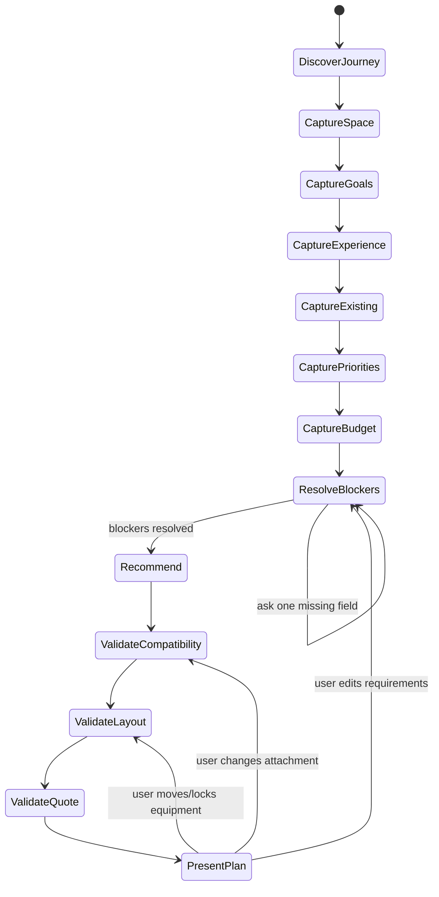
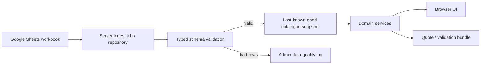
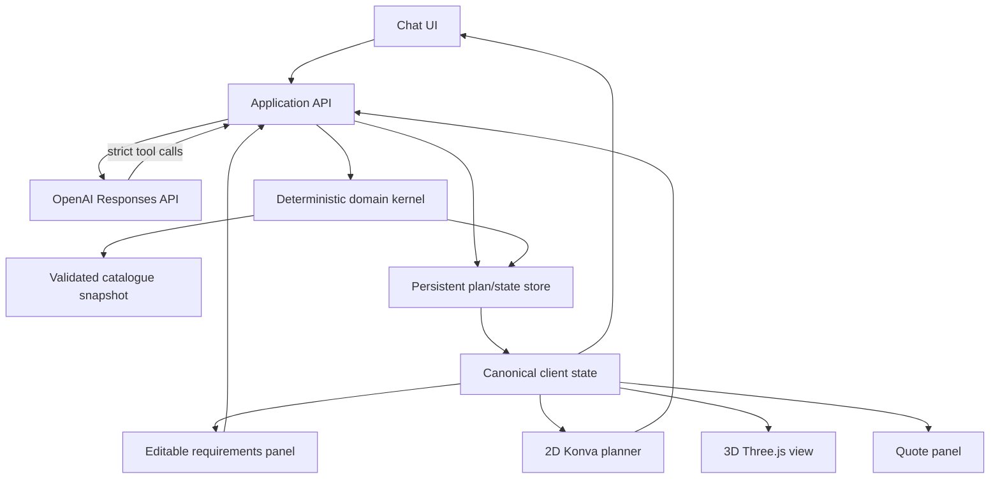
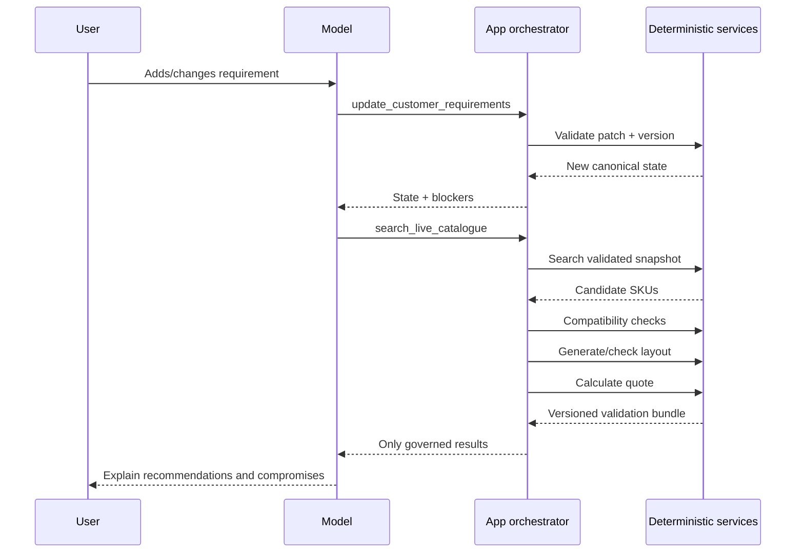

# Northstar Space Planner: Evidence Dossier for Implementation

## Executive summary

**Scope status — verified fact.** The governing brief is not an open-ended market study. It fixes the Northstar product direction: an Ireland/Europe-focused home-gym planning assistant with conversational requirements gathering, a live Google Sheets catalogue, deterministic geometry/compatibility/stock/arithmetic/budget validation, an editable top-down plan, and a simplified 3D representation sharing the same coordinates. It explicitly prohibits treating matching dimensions alone as proof of attachment compatibility and requires missing specifications to remain unknown. fileciteturn0file0

**Recommendation.** Build Northstar around a **canonical, versioned planning state and deterministic domain kernel**, with the language model acting as a conversational interpreter and explainer rather than an authority for product facts. The browser should render an editable 2D plan from that canonical state and a simplified Three.js scene from the same millimetre coordinates. The server should own catalogue ingestion, typed parsing, compatibility decisions, geometry validation, layout generation, stock/pricing, and quote arithmetic. This boundary is strongly supported by current OpenAI function-calling and Structured Outputs capabilities, which permit strict schemas, while OpenAI’s older Assistants API is deprecated and scheduled to shut down on August 26, 2026. citeturn9view0turn9view4turn19search0

**Verified fact.** Real rack ecosystems demonstrate why compatibility cannot be reduced to a single “3 × 3 inch” or “60 × 60 mm” field. Mirafit’s M3 uses 60 × 60 × 3 mm uprights and 17 mm holes, while Rogue’s Monster Lite and Monster families both use nominal 3 × 3 inch uprights but differ in their 5/8-inch versus 1-inch hardware ecosystems. Bells of Steel explicitly warns that “true” 3 × 3 inch uprights are 76.2 × 76.2 mm rather than 75 × 75 mm, that metric variants may not fit, that multi-pin attachments can suffer hole misalignment, and that tolerances differ even when headline dimensions match. citeturn0search0turn1search0turn1search7turn17search2

**Recommendation.** Compatibility should therefore have five customer-visible results: **explicitly compatible; compatible with named adapter or condition; dimensionally matching but unapproved; incompatible with exact failed constraints; insufficient information**. Only governed relationship evidence—not an LLM inference and not a dimensional match—may produce either of the first two states.

**Verified fact.** Equipment “footprint” and usable operating space are demonstrably different concepts. Concept2 lists the RowErg at 2,440 × 610 mm assembled but recommends 2,740 × 1,220 mm of space for use. Life Fitness likewise publishes machine dimensions separately from larger space requirements for some home-gym systems. Folding racks have a further distinction between installed, deployed, folding-path, and folded envelopes. citeturn0search10turn13search15turn4search10

**Recommendation.** Northstar’s spatial model should consequently maintain separate geometries for static footprint, manufacturer-declared operating envelope, loading/service access, circulation assumption, folding/movement path, installation/anchoring access, and vertical movement. Official clearances should be distinguished visibly from Northstar planning assumptions. Passing the geometry engine must never be described as an installation or exercise-safety certification.

**Recommendation.** For the prototype, use a **deterministic candidate-placement heuristic with exact geometric validation**, rather than attempting a full continuous optimization problem initially. Preserve locked placements; generate wall/corner/adjacency candidate anchors; test allowed rotations; reject hard constraints; then score remaining valid layouts on access, goal coverage, multipurpose utility, and budget. A discretized constraint-programming solver such as OR-Tools CP-SAT is credible for a later solver path, but CP-SAT works over integers and would complicate irregular compound clearances and continuous placement. citeturn15search1turn15search3turn15search12

**Recommendation.** Use **Konva for the editable 2D planner and Three.js for 3D**, but neither should be the source of geometry truth. Konva provides an interactive canvas object model and transform controls; importantly, its Transformer represents resize through scale values rather than directly changing width and height, so UI transforms should be normalized immediately back into canonical millimetres. Three.js supplies the 3D scene, bounds and camera controls; its own responsive-rendering guidance requires keeping CSS canvas size, drawing-buffer size, and camera aspect synchronized. citeturn5search1turn5search3turn16search0turn16search1turn20search1

**Recommendation.** Google Sheets is suitable as the prototype’s editorial catalogue, **not as the request-time domain model**. Fetch and batch-read server-side, parse every row into a typed snapshot, reject malformed records, retain a last-known-good snapshot, and identify each plan/quote with the catalogue snapshot used. The Sheets API currently has per-minute quotas and can return 429, 500 and 503 failures; Google recommends batching and exponential backoff. citeturn18search0turn18search1turn18search4

**Verified fact.** The consumer-trust boundary matters even for a prototype intended to evolve into commerce. Ireland’s CCPC states that commercial information can be misleading where it is false, deceptive, or incomplete; EU consumer information rules require clear total pricing, while the EU General Product Safety Regulation has applied since December 13, 2024 and includes safety considerations around products used in conjunction with other products. Ireland’s implementation of the European Accessibility Act took effect on June 28, 2025, including e-commerce services within scope. citeturn10search12turn10search2turn11search16turn12search0

The implementation decisions with the strongest evidence are summarized below.

| Decision | Status | Evidence and implication |
|---|---|---|
| LLM interprets and explains; code validates facts | **Recommendation** | Strict tool schemas are available; product geometry and compatibility are too consequential and structured to leave to free-form generation. citeturn9view0turn9view4 |
| Use Responses API, not Assistants API | **Recommendation** | Assistants API is deprecated and scheduled to shut down August 26, 2026. citeturn19search0 |
| Compatibility is relationship-governed | **Verified fact → recommendation** | 75 mm vs 76.2 mm and 5/8-inch vs 1-inch ecosystems make nominal labels insufficient. citeturn17search2turn1search0turn1search7 |
| Store footprint and operating envelope separately | **Verified fact → recommendation** | Concept2 publishes materially larger use space than assembled footprint. citeturn0search10 |
| Millimetres are canonical geometry units | **Recommendation** | Avoids repeated metric/imperial conversions and works naturally with European source data and integer geometry. |
| 2D editable; 3D derived from same state | **Recommendation** | Prevents divergent plans and allows an accessible non-canvas representation to coexist with visualization. citeturn12search1 |
| Google Sheets → validated snapshot → domain services | **Recommendation** | Sheets has quotas/service errors and should be insulated behind a repository/parser layer. citeturn18search0turn18search1 |
| Never silently infer unknown specifications | **Recommendation** | Directly follows the product brief and prevents dimensional or safety claims from being transformed into fabricated facts. fileciteturn0file0 |
| Geometry pass is not a safety certificate | **Recommendation** | Manufacturers themselves condition installation on suitable walls/floors, stabilizers, anchoring or professional assessment. citeturn0search0turn0search2turn4search3 |

## Scope, research method, customer conversation, and MVP

**Scope — verified fact.** Research was conducted for the implementation question defined in the supplied Northstar brief rather than for the user’s otherwise-unspecified topic. The report assumes a browser product, a rectangular primary room, EUR pricing, a Google Sheets source catalogue, fictional Northstar SKUs grounded in real specifications, and deterministic ownership of fit, compatibility, stock, money and quote validity. fileciteturn0file0

**Unknown.** The brief does not specify Northstar’s final commercial pricing, exact delivery regions and charges, tax treatment beyond an Ireland/Europe focus, installer relationships, exact number of launch SKUs, permitted anchoring policies, or whether users’ existing equipment will be limited to known reference models. These should remain configuration decisions rather than be invented during implementation.

**Methodology.** The evidence search was performed on August 11, 2026. Sources were prioritized in this order: current manufacturer pages/manuals for physical dimensions and compatibility; official OpenAI, Google, Three.js, Konva and W3C documentation for implementation behavior; EUR-Lex and Irish CCPC material for consumer-facing boundaries; then recent academic work for conversational recommendation. Manufacturer marketing prose was not treated as reusable catalogue copy. Product measurements were normalized to millimetres and kilograms while preserving the original source representation wherever conversions matter.

**Source-quality limitation — unknown.** There appears to be little directly applicable peer-reviewed research on *conversational home-gym specification elicitation*. Recent conversational-recommender research is useful for dialogue design but is not gym-specific. PEARL, published in ACL Findings 2024, supports the importance of detailed preferences and domain knowledge in recommendation dialogue, while a 2025 preprint found that users’ preferred conversational style can differ with expertise and control preference; the latter should be treated as provisional evidence rather than equivalent to a peer-reviewed design standard. citeturn14search0turn14academia12turn14academia14

**Verified fact.** Professional equipment-design processes do, however, converge on a compact sequence: understand the space, project requirements and desired training environment; produce an equipment/layout proposal; revise it with the customer; then address delivery/installation/site requirements. Eleiko describes essentially that workflow for both facilities and home gyms. citeturn13search17turn13search10turn13search11

**Recommendation — conversation model.** Northstar should use that same structure but progressively disclose questions instead of rendering a long form. Each turn should normally ask **one blocking or high-information question**, while a persistent “Your plan” panel exposes all captured fields for direct editing.

The minimum discovery state should be:

| Field | Why it is needed | Blocking? | Recommended conversational form |
|---|---|---:|---|
| Journey: new space / upgrade | Changes whether room design or compatibility dominates | Yes | “Are we building a gym from scratch, or adding to equipment you already have?” |
| Room L × W × H | Required for deterministic geometry | Yes for spatial recommendations | Ask in one compact dimension question, accept m/cm/mm and convert |
| Doors/fixed obstructions | Creates prohibited zones | Yes where present | Ask after basic dimensions, with simple placement controls |
| Main goals | Drives equipment coverage scoring | Yes | Offer strength, bodybuilding, cardio, calisthenics, general/mixed plus free text |
| Experience | Controls language and spec depth | Yes | Beginner / some experience / experienced |
| Intended users | Affects adjustability and vertical/use constraints | Usually | Ask how many and whether materially different body sizes matter |
| Existing equipment | Essential for upgrade and duplicate avoidance | Yes for upgrade | Make/model where known; dimensions do not substitute for identification |
| Priorities | Enables compromises | Yes | E.g. maximum versatility, floor space, free weights, cardio, storage |
| **Maximum budget** | Mandatory under the brief | Yes | “What is the maximum all-in budget I must not exceed?” |
| Mounting constraints | Governs rack eligibility | Conditional | “Can equipment be bolted to the floor or wall?” |
| Noise/floor-impact sensitivity | Affects flooring/equipment choice | Conditional | Ask only when dropping weights/cardio is relevant |

**Recommendation.** Treat the budget as a hard constraint by default. The assistant may explain that no valid configuration exists within it, but may not silently raise it. A deliberately over-budget alternative should only appear as a clearly separated comparison after explicit user consent.

**Recommendation — goal-specific follow-ups.** Keep conditional questioning short:

| Goal | High-value follow-ups | Avoid asking initially |
|---|---|---|
| Strength / powerlifting | Main lifts; rack vs stand preference; planned loading; inside/outside rack use; safety/spotter preference; desired attachments | Every possible rack specification |
| Bodybuilding | Priority muscle groups; dumbbell range; cable/machine preference; supersets; storage priority | Exercise-by-exercise program |
| Cardio | Preferred modality; frequency; noise; storage/folding; tallest/heaviest intended user where equipment limits depend on it | Detailed physiological testing |
| Calisthenics | Pull-ups/dips/rings; ceiling constraints; wall/floor anchoring permission; weighted work | Rack ecosystem fields until relevant |
| General fitness | Training frequency; shared users; preferred versus disliked modes; storage and versatility | Specialist performance terminology |

**Inference.** Asking about intended training style, space and goals mirrors the information used by professional gym-design services, while adaptively increasing terminology depth for experienced users is supported by broader conversational-recommender evidence. citeturn13search11turn14academia14

**Recommendation — expertise adaptation.** Ask the same underlying state question in different language. A beginner might be asked, “Would you like to squat and bench with a barbell safely on your own?” An experienced customer can be asked, “Do you want a four-post rack, half rack or squat stand, and do you already have an attachment ecosystem you need to preserve?” Store the answer in the same structured fields.

**Recommendation — conversational state machine.**



**Recommendation.** The state machine should not literally determine every conversational utterance. Instead, a deterministic `next_required_fields` service should expose blocking gaps and conflicts; the LLM selects a friendly phrasing for one of them.

Each customer-state field should carry at least:

```text
value
unit
status: unknown | provided | confirmed | conflicted
source: chat | visible_control | imported_existing_equipment
last_changed_at
last_changed_by
```

A global `requirements_version` should increment on every accepted edit. Layouts, compatibility reports and quotes store the exact version they validated. Any relevant edit immediately makes old derived outputs **stale**, never silently valid.

**Recommendation — MVP boundary.** The smallest credible MVP still contains all fixed product elements:

| Include at launch | Defer without changing the product |
|---|---|
| Chat plus editable requirements | Voice conversation |
| Rectangular room plus door/obstruction zones | Arbitrary room polygons, sloping ceilings and scanned rooms |
| Seeded fictional Northstar catalogue covering all required categories | Very deep SKU range |
| Explicit internal compatibility relationships | Broad automatic cross-brand certification |
| 90° auto-placement rotations; direct user rotation may be richer | Sophisticated continuous global optimization |
| Deterministic fit, budget and quote validation | Structural engineering calculations |
| Editable 2D planner | Direct manipulation inside 3D |
| Recognisable, simplified Three.js 3D | Photorealistic commercial-product models |
| Server-side Sheets ingestion with last-known-good cache | Realtime inventory event streaming |
| EUR and region-aware delivery fields | Multi-currency commerce |
| Accessible DOM representation of the plan | Advanced AR/VR |

The fixed concept must not be collapsed into a static catalogue, questionnaire-only wizard or generic chatbot. fileciteturn0file0

## Catalogue blueprint, normalized schema, and live-data governance

**Verified fact.** Real current equipment specifications show substantial diversity even within seemingly simple categories. Mirafit’s M3 rack family uses 60 × 60 × 3 mm uprights, 17 mm holes and differing 25/50 mm hole spacing regions, with several available heights and depths; Mirafit’s M4 moves to a 75 mm upright family and 17.5 mm holes. citeturn0search0turn0search4

**Verified fact.** Other representative equipment illustrates the breadth of fields Northstar needs. Concept2’s RowErg has a 2,440 × 610 mm assembled footprint but a 2,740 × 1,220 mm recommended use space; Eleiko adjustable and flat benches are approximately 1.23–1.24 m long but differ materially in width, mass and adjustability; Eleiko training plates use 450 mm diameter with weight-dependent thickness; current flooring products span different tile dimensions and thicknesses with explicit limitations on high-impact use. citeturn0search10turn2search4turn2search10turn2search7turn3search3turn3search12

**Recommendation.** Northstar should seed fictional products by **engineering pattern**, not by disguised one-to-one copies of commercial SKUs. The realistic ranges below are evidence anchors, not claims that every product in a category has these properties.

| Northstar seed family | Suggested launch coverage | Evidence-backed realism anchor | Status |
|---|---|---|---|
| Squat stands | Entry / mid | 60–76.2 mm ecosystems exist; anchoring/stability differs by design | **Recommendation**, grounded in rack sources citeturn0search5turn17search4 |
| Four-post racks | Compact / standard / premium | Approx. 1.88–2.33 m heights are available in Mirafit M3; ecosystems vary by upright and hole interface | **Verified fact** citeturn0search0 |
| Folding racks | Shallow / standard | Commercial examples use roughly 0.55 or 1.05 m deployed inside depth and have distinct folded envelopes | **Verified fact** citeturn4search3turn4search10 |
| Benches | Flat / adjustable | Eleiko examples: ~1,230–1,240 mm long, 410–606 mm wide, 25–40.5 kg | **Verified fact** citeturn2search4turn2search10 |
| Rack attachments | J-cup/safety, dip, landmine, storage, roller | Side, pin, hole, host family and structural conditions all matter | **Verified fact** citeturn1search1turn17search8 |
| Row/cardio | One rower plus one compact alternative | RowErg footprint 2,440 × 610 mm; use envelope 2,740 × 1,220 mm | **Verified fact** citeturn0search10 |
| Barbells | General / power-oriented | Representative Eleiko bars are 2,200 mm and 20 kg with 28–29 mm shaft examples | **Verified fact** citeturn2search3turn2search5 |
| Plates | Starter / full sets | 450 mm-diameter training plates; thickness varies substantially by mass | **Verified fact** citeturn2search7 |
| Dumbbells | Select pairs / set | Eleiko offers a broad 1–40 kg family; a 7 kg example is 300 × 120 × 105 mm | **Verified fact** citeturn2search9 |
| Kettlebells | Light / medium / heavy | Dimensions are weight-dependent; 14 kg and 24 kg examples differ in height | **Verified fact** citeturn3search7turn3search9 |
| Flooring | General / heavier-impact | 12, 20 and 40 mm examples have different stated uses/limitations | **Verified fact** citeturn3search3turn3search12 |
| Storage | Vertical / horizontal | Examples include 550 × 400 × 1,535 mm vertical storage and 1,720 mm shelf systems | **Verified fact** citeturn3search0turn3search2 |

**Unknown.** Precise Northstar launch price bands are not specified and should not be fabricated from manufacturer retail prices. Northstar’s own fictional EUR price should be a commercial input with a timestamp and tax/delivery basis. Manufacturer prices may be retained as internal reasonableness references, but they should not be presented as provenance for Northstar’s price.

**Recommendation — canonical schema.** Separate identity, sellable variation, physical geometry, rack interfaces, compatibility relationships, clearances, commercial availability and evidence.

| Table | Core fields | Why it belongs here |
|---|---|---|
| `Product` | `product_id`, category, Northstar family, customer name, original short description, training-use tags, skill suitability, lifecycle status | Stable concept shared by variants |
| `Variant` | `variant_id`, `product_id`, SKU, configuration, product mass, declared load value/type, anchoring mode, material, steel gauge where supplied | Sellable physical configuration |
| `Geometry` | `geometry_id`, `variant_id`, footprint shape type, length/width/height mm, local origin, orientation reference, compound polygon data | Physical dimensions and scene generation |
| `RackInterface` | host/attachment role, upright nominal dimensions, upright actual dimensions if supplied, hole diameter/nominal hardware, vertical spacing pattern, pin diameter, mounting side, depth requirement, generation/family, keyhole/slot details | Structured mechanical interface; not itself compatibility approval |
| `Clearance` | `clearance_id`, variant, clearance type, polygon/offset, vertical range, operating state, hardness, evidence status | Separates footprint from use/access envelopes |
| `Compatibility` | relationship ID, host entity/family, attachment, decision state, adapter, conditions, failed constraints, version/generation scope, approval authority, review date | Approval is a relationship, not a derived product property |
| `StockPrice` | SKU, region, currency, gross EUR price, tax basis, delivery component, install component, stock state/quantity if known, observed timestamp, validity | Transactional and volatile data |
| `Source` | source ID, URL, publisher, title, document type, version/date, access date, content hash where practical | Provenance identity |
| `Evidence` | evidence ID, source ID, target entity/field/relation, source locator, supplied value, evidence state, confidence, reviewer, conflict group | Field-level traceability |
| `TrainingTag` / join | product/variant, goal/use, suitability level | Recommendation coverage without embedding prose |

**Recommendation.** Use millimetres as integer canonical geometry values and kilograms for mass. Preserve source values separately when they originated in inches. For example, a true 3-inch upright is exactly 76.2 mm by conversion, whereas a manufacturer’s “75 mm” system should remain 75 mm; Northstar must not normalize both to a generic “3 × 3.” Bells of Steel explicitly identifies this difference as a source of compatibility failures. citeturn17search1turn17search2

**Recommendation — unknowns.** Never use blank, zero and false interchangeably. Critical facts should have an evidence status:

```text
verified          source explicitly supplies the value
not_provided      relevant source was checked but did not provide it
conflicting       authoritative sources disagree
assumption        Northstar policy or conservative planning value
not_applicable    field has no meaning for this variant
unresearched      no governed evidence review has happened yet
```

A numerical field is usable for deterministic customer claims only where the status and confidence policy permit it. `not_provided` must not be converted to an estimate by the model.

**Recommendation — confidence.** Use evidence confidence as a controlled enum rather than an arbitrary model percentage: `high`, `medium`, `low`. High should normally mean current manufacturer/manual or Northstar-controlled product definition; medium could cover an explicit but ambiguous current manufacturer statement; low is suitable for planning assumptions but not compatibility approval.

**Verified fact.** Manufacturer source conflicts and qualifications are normal. A rack can require bolting down in one configuration but not another; Mirafit’s M3 power-rack instructions distinguish the 900 mm model with a rear stabilizer from other configurations, while its half rack is described as flat-foot and not requiring bolting. citeturn0search0turn0search5

**Recommendation.** Therefore, do not store `requires_bolting: boolean` at product-family level. Store the condition at variant/configuration level and link it to evidence.

**Recommendation — Google Sheets workbook.** A practical workbook layout is:

| Sheet | Editing rule |
|---|---|
| `Products` | Human-maintained stable product identities |
| `Variants` | One row per sellable SKU/configuration |
| `Geometry` | Typed physical values only |
| `RackInterfaces` | Mechanical interface facts |
| `Clearances` | One row per named clearance zone |
| `Compatibility` | Governed approvals, adapters, exclusions |
| `PricesStock` | Volatile commercial snapshot |
| `TrainingTags` | Controlled many-to-many tags |
| `Sources` | Source metadata |
| `Evidence` | Field/relation provenance |
| `ValidationLists` | Allowed enums and schema version |

**Verified fact.** Google’s Sheets API supports batching value reads, currently limits reads to 300 requests per minute per project and 60 per minute per user/project, and recommends exponential backoff for rate-limit failures. It can also return 503 when the service is unavailable or requests/spreadsheets are too complex. citeturn18search0turn18search1turn18search4

**Recommendation — access pattern.**



The browser should never call the workbook directly. A backend repository should batch-read only the required ranges, parse values strictly, normalize units, run referential-integrity checks, reject duplicate IDs and invalid enums, and atomically publish a new snapshot only when required launch-critical tables validate. Google specifically recommends constrained reads and batching to reduce request volume and service problems. citeturn18search0turn18search1

**Recommendation — cache policy.** For a small prototype, a **30–120 second refresh target** is a reasonable engineering policy, not a Google requirement. Prices and stock should show `observed_at`; quotes should store `catalogue_snapshot_id`. Before a checkout-like commitment, refresh commercial data again. If Sheets is unavailable, use last-known-good data only if it is within Northstar’s configured freshness policy and label it “last checked …”; otherwise disable new pricing/stock claims while preserving plan editing.

**Recommendation — bad-data behavior.** A malformed noncritical row can be quarantined and excluded from recommendations. A malformed compatibility relation, product identity, currency, or required price field should fail the new snapshot rather than partially overwrite known-good data. Duplicate primary keys should always be a snapshot-blocking error.

**Recommendation — future database.** Hide Sheets behind an interface such as `CatalogueRepository.getSnapshot()`. A later relational database can implement the same canonical objects and tool contracts. This preserves the prototype requirement while avoiding spreadsheet conventions leaking into chat, geometry or quote code.

## Compatibility and spatial-planning model

**Verified fact.** Rack compatibility is multidimensional. Mirafit’s M3 uses 60 × 60 mm uprights and 17 mm holes; its published product material distinguishes M3 from older M100/M200 systems. Rogue Monster Lite uses 3 × 3-inch uprights with 5/8-inch hardware, while Rogue Monster uses the same nominal upright cross-section with 1-inch hardware. citeturn0search4turn1search0turn1search7

**Verified fact.** Cross-brand compatibility is even less reducible to measurements. Bells of Steel states that its Hydra uses *true* 76.2 × 76.2 mm uprights, warns that nominal metric 75 × 75 mm racks may not fit, notes that multi-pin attachments may suffer hole misalignment, and says tolerances vary and cross-brand compatibility is not guaranteed. citeturn17search2

**Verified fact.** Attachment compatibility can also depend on direction, base configuration and obstructions. Rogue states that some attachments are family-specific; Bells of Steel documents cable-attachment requirements involving rack height and crossmember depth; Mirafit notes cases where storage hardware sharing crossmember holes can require different bolts. citeturn1search1turn17search7turn0search12

**Recommendation — compatibility ontology.** Store at least these constraint families:

```text
host ecosystem / product generation
upright nominal cross-section
upright actual cross-section, where supplied
hole diameter or stated hardware class
attachment pin diameter
hole-spacing pattern
number of pins / multi-hole alignment
front / side / rear mounting orientation
required clear upright face
rack internal/external depth
crossmember geometry
base type / stabilizer
anchoring status
bracing or obstruction conflicts
adapter identity
attachment generation/version
manufacturer-declared exclusions
```

**Recommendation.** Keep `hole_diameter` and `pin_diameter` distinct. A source may publish only a nominal hardware family such as 5/8 inch; that should not be silently converted into an assumed exact drilled-hole diameter.

The deterministic decision table should be:

| Customer state | Required evidence | Result |
|---|---|---|
| Exact host/attachment combination explicitly approved by manufacturer or governed Northstar relationship; all stated conditions satisfied | Current explicit relationship evidence, correct versions | **Explicitly compatible** |
| Explicit approval requires named adapter, stabilizer, orientation or mounting condition and the plan satisfies it | Explicit relation + adapter/condition evidence | **Compatible with named adapter or condition** |
| Dimensions/pins appear to satisfy all known measured constraints, but no approved relationship exists | Sufficient dimensional facts but no approval evidence | **Dimensionally matching but unapproved** |
| At least one required constraint is known to fail | Verified values supporting exact failure | **Incompatible with exact failed constraints** |
| Any approval-critical fact is missing/conflicting, host identity is uncertain, or source coverage is inadequate | Missing/conflicting governed evidence | **Insufficient information** |

**Recommendation.** `dimensionally_matching_but_unapproved` must never be worded “compatible.” A suitable UI sentence is: **“The recorded dimensions match the checks we can perform, but Northstar has no approved compatibility relationship for these products.”**

**Recommendation — evidence hierarchy.**

| Rank | Evidence | What it may authorize |
|---|---|---|
| Highest | Current manufacturer manual or explicit manufacturer compatibility table naming the host/attachment/version | Explicit compatibility/incompatibility |
| High | Northstar’s own controlled product-definition/verification record for fictional Northstar SKUs | Explicit Northstar-to-Northstar relation |
| High–medium | Manufacturer statement defining a conditional cross-brand fit, with all conditions recorded | Conditional compatibility only |
| Medium | Current manufacturer dimensions for both products | Dimensional match/failure, **not approval** |
| Low | Distributor summaries or unversioned secondary material | Research lead; generally not customer approval |
| Excluded for approval | Forums, anecdotes, LLM reasoning from nominal dimensions | Never approve |

The logic should deliberately err toward `insufficient_information` or `dimensionally_matching_but_unapproved`. The manufacturer evidence supports that conservative treatment: even one company marketing an “open ecosystem” still warns that tolerances and multi-pin alignment prevent guaranteeing arbitrary cross-brand fit. citeturn17search2

**Verified fact — spatial taxonomy.** Official product data supports at least four fundamentally different geometric states. A Concept2 RowErg is 2,440 × 610 mm assembled but requires a 2,740 × 1,220 mm space for use; a Dynamic RowErg has its own assembled/use dimensions and explicitly cannot be stored standing on end; folding racks have deployed and folded depths; racks may also have installation/anchoring requirements independent of geometric fit. citeturn0search10turn0search13turn4search10turn0search2

Northstar should model clearances as follows:

| Geometry | Treatment | Evidence rule |
|---|---|---|
| Static footprint | Hard collision | Product dimensions |
| Manufacturer operating envelope | Hard while equipment is usable | Manual/product page |
| Folding/deployment path | Hard motion-swept zone | Product/manual evidence |
| Door/window prohibited zone | Hard according to user room state | User-provided |
| Ceiling/product height | Hard | Product height + room height |
| Documented movement height | Hard | Manufacturer evidence |
| Loading/service access | Hard or warning according to source | Manufacturer evidence where available |
| Installation/anchoring access | Installation warning/constraint | Manufacturer evidence |
| General circulation | Northstar planning policy, not manufacturer fact | Clearly labelled assumption |
| Barbell plate-loading convenience zone | Northstar planning policy unless documented | Clearly labelled assumption |

**Unknown.** The reviewed primary evidence does **not** establish one universal safe home-gym circulation distance that applies to every product, exercise and user. Northstar should therefore resist presenting a generic aisle number as an industry safety requirement.

**Recommendation.** A configurable planning buffer such as **600 mm** can be useful as an MVP *layout preference*, but it must be stored as `source_type = northstar_assumption`, be adjustable by policy, and never be presented as a manufacturer or statutory safety clearance.

**Recommendation — shared coordinate system.**

```text
Canonical units: integer millimetres

Room origin: floor, one defined inside corner
X: room width
Y: vertical height
Z: room length/depth

2D planner uses: X,Z
3D scene uses: X,Y,Z
Rotation: degrees about +Y
Object position: canonical local-origin point, not canvas pixels
```

Every placement should look approximately like:

```json
{
  "placement_id": "plc_018",
  "variant_id": "NS-RACK-060-BLK",
  "x_mm": 850,
  "z_mm": 420,
  "rotation_deg": 90,
  "locked": true,
  "geometry_version": "geom-v3"
}
```

**Recommendation — geometry engine.** Convert every footprint and clearance to polygons in local coordinates, then transform by placement. For rectangles, use oriented-rectangle intersection; for compound equipment and door sweeps, use general polygon intersection. Broad-phase bounding boxes can reject obviously separated objects; exact polygon tests decide validity. Three.js `Box3` is useful for rendering/debug bounds, but the browser renderer should not replace the canonical 2D validator. citeturn16search0

**Recommendation — MVP layout heuristic.**

1. Validate all locked placements first. If locked items conflict, return that contradiction instead of moving them.
2. Remove any candidate equipment missing hard geometry.
3. Generate deterministic candidate anchors at room corners, walls, obstruction boundaries and edges of already placed objects.
4. Test permitted rotations, initially 0° and 90° for auto-layout unless a variant requires a fixed orientation.
5. Reject candidates violating room bounds, ceiling, prohibited zones, footprint collisions or hard operating envelopes.
6. Score feasible partial layouts.
7. Use deterministic best-first search plus a bounded number of seeded restarts for alternatives.
8. Return several valid layouts only when all hard constraints pass.

A practical objective can be:

```text
score =
  goal_coverage
+ multipurpose_utility
+ preferred_access
+ usable_open_floor
- soft_clearance_penalties
- budget_headroom_penalty
- awkward_circulation_penalty
```

Budget itself remains a hard filter unless the customer explicitly requests an over-budget comparison.

**Inference.** This heuristic is more appropriate for an early prototype than a sophisticated optimizer because Northstar will normally place a small number of large items and needs explainable failures more than mathematically proven global optimality.

| Approach | Strengths | Weaknesses | Northstar decision |
|---|---|---|---|
| Greedy/best-first candidate placement | Simple, deterministic, easy to explain and preserve locks | May miss good global arrangements | **MVP recommendation** |
| Exhaustive grid search | Can prove “none on this grid”; predictable | State space grows rapidly; resolution-dependent | Use for small hard cases/testing |
| Simulated annealing/genetic search | Flexible continuous optimization | Harder reproducibility/explanation; no infeasibility proof | Later experimental option |
| CP-SAT on discretized coordinates | Strong explicit constraints and solver statuses; OR-Tools reports feasible/infeasible/unknown states | Integer/discrete model; irregular polygons/soft dynamic envelopes add complexity | Later solver/verification path citeturn15search1turn15search3 |

**Recommendation — failure taxonomy.** Never return only “doesn’t fit.” Tools should return structured reasons that can be translated into human language:

| Code | Example explanation |
|---|---|
| `ROOM_BOUNDS` | “The rack extends 140 mm beyond the east wall at this orientation.” |
| `CEILING_TOO_LOW` | “The product is 2,080 mm high; the recorded ceiling is 1,980 mm.” |
| `FOOTPRINT_COLLISION` | “The bench footprint overlaps the rack base.” |
| `OPERATING_CLEARANCE_COLLISION` | “The rower itself fits, but its manufacturer-declared use area overlaps the doorway.” |
| `DOOR_SWING_BLOCKED` | “The equipment intersects the recorded door-swing zone.” |
| `LOCKED_ITEMS_CONFLICT` | “Two items you locked overlap; Northstar will not move either automatically.” |
| `ANCHORING_CONDITION_UNMET` | “This configuration requires anchoring, but the plan says floor fixing is not permitted.” |
| `MISSING_DIMENSIONS` | “The product’s deployed depth is not provided, so fit cannot be validated.” |
| `UNAPPROVED_COMPATIBILITY` | “Recorded dimensions match, but no approved attachment relationship exists.” |
| `BUDGET_EXCEEDED` | “The validated quote is €184 above the €2,500 maximum.” |

**Safety boundary — recommendation.** A spatial pass means only that the recorded geometry satisfies the encoded constraints. Manufacturers themselves state requirements such as bolting racks down, fitting stabilizers, ensuring structurally suitable walls/floors or consulting an appropriate professional. Northstar should never transform a geometric result into “safe to install.” citeturn0search0turn0search2turn4search3

## Shared browser, AI/tool, and UX architecture

**Recommendation — browser stack.** Use a conventional component-based TypeScript web application, with Konva owning interactive 2D rendering and Three.js owning 3D visualization. The application state—not either graphics library—owns placements.

**Verified fact.** Konva supplies an HTML5 Canvas object model with drag/event handling and React integration. Its Transformer can resize and rotate nodes, but resizing changes `scaleX`/`scaleY`, not the underlying width/height fields. citeturn5search1turn5search3

**Recommendation.** On a Konva transform end event, calculate the new world geometry, round according to Northstar’s coordinate policy, set the canonical real-world dimensions/rotation or placement, reset display scales as appropriate, run deterministic validation, and then rerender. Do not serialize arbitrary Konva scale state as product geometry.

**Verified fact.** Three.js provides world-space bounding boxes, OrbitControls with orbit/zoom/pan functionality, and instanced meshes to reduce draw calls for repeated geometry. Its responsive guide emphasizes synchronizing camera aspect with the canvas display size and only resizing the drawing buffer when needed. citeturn16search0turn20search1turn20search0turn16search1

**Recommendation — 3D modelling.** Do not obtain commercial product CAD or scrape manufacturer 3D assets. Build recognisable Northstar primitives programmatically:

| Item | Minimal original 3D model |
|---|---|
| Rack | Box-section uprights, crossmembers, base feet, pull-up bar, safeties; dimensions driven from variant geometry |
| Bench | Base rails, uprights, seat pad and back pad as simple boxes; adjustable bench can show representative selected angle |
| Dumbbell area | Storage rectangle plus a small number of simplified dumbbell primitives/instances |
| Rower/cardio | Long rail/body, seat, flywheel housing and handle envelope; prioritize correct overall size over detail |
| Plates | Cylinders with source-driven diameter/thickness where available |
| Flooring | Flat tile/area plane with thickness optionally exaggerated only in explanatory UI, never geometry |

**Recommendation.** Geometry accuracy should be concentrated on the **collision envelope and recognisable silhouette**, not manufacturing detail. This avoids copyright/trade-dress dependence and keeps rendering cheap.

**Recommendation — rendering model.** The 3D room should use the same canonical placements, with floor at `Y=0`; walls generated from room boundaries; perspective camera centered on the room bounds; OrbitControls constrained so users cannot easily lose the room; front-wall hiding/toggling for visibility; and a “Reset view” command that frames the room from its current bounding box. OrbitControls officially supports orbit, dolly/zoom and pan. citeturn20search1

**Recommendation — canvas failure testing.** Explicitly test:

- zero-width or zero-height parent containers;
- route/tab activation after the canvas was initially hidden;
- desktop/mobile resizing;
- camera aspect after panel widths change;
- camera target after room size changes;
- WebGL context creation failure;
- empty scene or all geometry behind the camera;
- excessive device-pixel ratio and drawing-buffer allocation.

These tests directly address failure modes implied by Three.js’s distinction between CSS display size and drawing-buffer size. citeturn16search1

**Recommendation — authorised fallback.** The credible MVP can make **2D the sole editing surface while 3D is read-only**. This still satisfies the brief’s shared 2D/3D representation and materially simplifies interaction and accessibility. Direct 3D manipulation is a later enhancement, not a condition of a credible first release. fileciteturn0file0

**Recommendation — application architecture.**



**Verified fact.** OpenAI’s function-calling architecture allows models to request application-defined functions and associate tool outputs with calls; current Structured Outputs supports schema-constrained responses, including `strict` schemas. Current documentation also allows `parallel_tool_calls: false` when the application requires at most one tool call at a time. citeturn8view0turn9view0turn9view1turn9view4

**Recommendation.** Northstar should use the **Responses API** with strict function schemas. Do not start an Assistants API implementation on August 11, 2026: OpenAI says that API is deprecated and scheduled to shut down on August 26, 2026. citeturn19search0

**Recommendation.** Do not make OpenAI-hosted conversation history the canonical customer-planning database. OpenAI’s Conversations API can persist model conversation/tool items, but Northstar’s own server should remain authoritative for requirements versions, product snapshots, layouts and quotes. citeturn9view3

The key tools should look conceptually like this:

```json
{
  "name": "update_customer_requirements",
  "input": {
    "plan_id": "plan_123",
    "expected_version": 17,
    "patches": [
      {
        "path": "budget_eur",
        "operation": "set",
        "value": 2500
      }
    ]
  },
  "output": {
    "requirements_version": 18,
    "accepted": true,
    "conflicts": [],
    "missing_blockers": ["room.height_mm"]
  }
}
```

```json
{
  "name": "search_live_catalogue",
  "input": {
    "plan_id": "plan_123",
    "requirements_version": 18,
    "categories": ["rack", "bench"],
    "stock_only": true,
    "max_combined_price_eur": 1800
  },
  "output": {
    "catalogue_snapshot_id": "cat_2026-08-11T14:02:00Z",
    "items": [],
    "excluded_count": 6,
    "warnings": []
  }
}
```

```json
{
  "name": "check_attachment_compatibility",
  "input": {
    "host_ref": {
      "type": "catalogue_variant",
      "id": "NS-RACK-60-V2"
    },
    "attachment_variant_id": "NS-DIP-60-V1"
  },
  "output": {
    "state": "explicitly_compatible",
    "conditions": [],
    "failed_constraints": [],
    "evidence_ids": ["ev_418", "ev_419"],
    "compatibility_policy_version": "compat-4"
  }
}
```

```json
{
  "name": "check_room_fit",
  "input": {
    "plan_id": "plan_123",
    "requirements_version": 18,
    "catalogue_snapshot_id": "cat_2026-08-11T14:02:00Z",
    "placements": []
  },
  "output": {
    "validated": false,
    "reasons": [
      {
        "code": "CEILING_TOO_LOW",
        "placement_id": "plc_9",
        "required_mm": 2080,
        "available_mm": 1980
      }
    ]
  }
}
```

```json
{
  "name": "generate_room_layout",
  "input": {
    "plan_id": "plan_123",
    "requirements_version": 18,
    "candidate_variant_ids": [],
    "locked_placement_ids": [],
    "seed": 42,
    "layout_policy_version": "layout-3"
  },
  "output": {
    "status": "feasible",
    "layouts": [],
    "unplaced_items": [],
    "warnings": []
  }
}
```

```json
{
  "name": "calculate_itemised_quote",
  "input": {
    "plan_id": "plan_123",
    "layout_id": "layout_5",
    "requirements_version": 18,
    "catalogue_snapshot_id": "cat_2026-08-11T14:02:00Z",
    "budget_eur": 2500
  },
  "output": {
    "currency": "EUR",
    "lines": [],
    "equipment_total_eur": 2110.00,
    "delivery_total_eur": 90.00,
    "other_total_eur": 0.00,
    "grand_total_eur": 2200.00,
    "within_budget": true,
    "remaining_budget_eur": 300.00
  }
}
```

**Recommendation — sequencing.**



**Recommendation — hard anti-hallucination rules.**

The model should be explicitly prohibited from converting its own reasoning into any of the following fields:

```text
fits_room
compatibility_state
stock_status
price
grand_total
within_budget
declared_load
product_dimension
anchoring_requirement
validation_status
```

It may only repeat these from a successful tool result whose `requirements_version`, `catalogue_snapshot_id` and policy versions remain current.

**Recommendation.** Treat tool failure as **lack of evidence**. A timeout from the compatibility service produces “I couldn’t validate compatibility just now,” never “it appears compatible.” A stale layout produces “the previous plan has not been revalidated since you changed the ceiling height,” never a cached fit assertion.

**Recommendation.** Use optimistic concurrency for chat and visible controls. `expected_version` prevents a delayed LLM tool call from overwriting a newer direct user edit. When versions differ, return `STATE_CONFLICT` and require the model to re-read the current state rather than retrying its stale patch.

**Recommendation — UX layout.** On desktop, a practical arrangement is chat alongside a persistent requirements/quote column and a large planner work area; on mobile, the same objects become tabs or stacked views rather than a squeezed multi-pane layout. The important architectural rule is that chat never hides the current structured answer to “what does Northstar believe my room/budget/equipment are?”

The UI should expose four statuses directly:

```text
Requirements: complete / missing / conflicted
Plan: validated / stale / invalid / not validated
Compatibility: one of the five governed states
Quote: current / stale / unavailable
```

**Verified fact.** WCAG 2.2 includes a requirement addressing dragging movements, so planner actions should not depend exclusively on drag gestures. W3C recommends WCAG 2.2 as the current WCAG generation. citeturn12search1turn12search8

**Recommendation — accessible planner fallback.** Every 2D placement should therefore also be editable through DOM controls: select item, numeric X/Z inputs, 90° rotate button, nudge commands, lock/unlock and remove. Provide a text/table representation such as “Bench: 850 mm from west wall, 420 mm from north wall, rotated 90°.” The canvas is a visual aid, not the sole interface.

## Consumer-trust boundary, delivery plan, evaluation, and risk register

**Legal-status caveat — recommendation.** This section is product-design research, not legal advice. Before Northstar becomes a real retailer or accepts orders, Irish/EU counsel or an appropriately qualified compliance specialist should review final product-safety, consumer-information, accessibility, tax and commerce flows.

**Verified fact.** Ireland’s CCPC describes a commercial practice as potentially misleading when the information is false, deceptive or incomplete. EU consumer-information guidance also requires the consumer-facing total price to include applicable taxes and additional charges or make unavoidable additional costs clear. citeturn10search12turn10search2

**Recommendation.** A Northstar quote should therefore distinguish equipment, delivery, installation where offered, discounts and other charges, show the EUR grand total prominently, identify when a delivery cost is still unknown, and timestamp stock/price data. An unknown delivery fee should not be rendered as €0.

**Verified fact.** The EU General Product Safety Regulation applies from December 13, 2024. Among its safety-assessment considerations is the effect of a product on other products where it can reasonably be foreseen that they will be used together. citeturn11search16turn11search0

**Inference.** That does not itself provide Northstar a rack-attachment compatibility algorithm, but it reinforces the prudence of governing combination claims rather than inferring them casually.

**Recommendation — customer-facing claim vocabulary.**

| Internal condition | Safe customer wording |
|---|---|
| Manufacturer dimension sourced | “Manufacturer-listed height: 2,080 mm. Source checked August 11, 2026.” |
| Missing dimension | “Height not provided in the governed source; Northstar has not estimated it.” |
| Northstar circulation assumption | “Northstar planning buffer: 600 mm. This is a planning assumption, not a manufacturer safety clearance.” |
| Geometric pass | “Fits the recorded room geometry and encoded clearances.” |
| Installation boundary | “This is not an installation-safety assessment; verify mounting surface, anchoring and current instructions before installation.” |
| Explicit compatibility | “Approved in our compatibility data for these recorded versions.” |
| Dimensional-only match | “Recorded dimensions match, but compatibility is not approved.” |
| Stale data | “Price/stock last checked at [time]; current availability could not be refreshed.” |
| Source conflict | “Sources disagree; Northstar cannot validate this specification yet.” |

**Verified fact.** Manufacturer installation instructions justify this conservatism. Mirafit states that some rack configurations must be bolted down and that floor fixing suitability varies; wall-mounted equipment requires a structurally suitable wall/floor. Rogue likewise advises attention to mounting conditions for wall racks and certain attachment uses. citeturn0search0turn0search2turn4search3

**Recommendation.** Never derive whole-system load capability by taking the lowest or highest individual component rating unless a manufacturer explicitly defines that calculation. Store `declared_load_type` alongside the value—e.g., manufacturer test load, user weight limit, rack capacity, shelf capacity—because these numbers are not interchangeable. Concept2, for example, distinguishes its own RowErg manufacturer-tested user weight from a lower EN-standard test figure. citeturn0search10

**Recommendation — brand/IP boundary.** Use source brands as evidence references, not as the identity of fictional Northstar products. Write original descriptions, create original simplified 3D geometry and label representative measurements as design inputs. Do not imply that a Northstar rack is endorsed by Mirafit, Rogue, Eleiko or another source simply because its fictional specification was calibrated against that source.

**Verified fact.** Ireland’s European Accessibility Act regime took effect June 28, 2025 and includes e-commerce services among covered categories; CCPC is an Irish compliance authority for relevant services. citeturn12search0

**Recommendation.** Even if the prototype initially stops at quoting, implement the planner from the start with keyboard alternatives, visible focus, semantic controls and non-canvas access to state; retrofitting a canvas-centric interaction later is substantially riskier.

**Recommendation — implementation phases.**

| Phase | Deliverables | Gate to proceed |
|---|---|---|
| **Governed data foundation** | Canonical schemas; workbook; seed fictional catalogue; provenance; typed parser; snapshot/versioning; deterministic money/unit utilities | No launch-critical malformed data; representative records trace to sources |
| **Domain validation kernel** | Compatibility decision engine; footprint/clearance geometry; quote service; reason codes; property tests | False-positive compatibility fixtures = zero; arithmetic exact to cents |
| **Planning application** | Persistent requirements; chat shell; catalogue search/compare; visible state; version conflicts | User edits and chat mutations converge on one canonical state |
| **Editable 2D** | Room/obstruction editor; placements; locking; validation overlays; heuristic layout | Locked items never move; invalid geometry is rejected/explained |
| **Derived 3D** | Procedural rack/bench/dumbbell/cardio models; shared coordinates; camera reset; responsive canvas | 2D and 3D placements match for reference fixtures |
| **AI integration** | Responses API; strict tools; state-aware sequencing; stale-output protection | Model cannot produce a passing claim without valid tool evidence |
| **Hardening/release** | Sheets outage behavior; accessibility; mobile; WebGL tests; adversarial prompts; monitoring | Full acceptance suite passes |

**Recommendation — comprehensive testing matrix.**

| Layer | Critical tests |
|---|---|
| Unit | Unit conversion, integer mm, money-in-cents, schema parser, compatibility predicates, polygon transforms, rotations |
| Property-based geometry | Random valid/invalid rectangles; boundary contact; rotations; translate-then-inverse; collision symmetry |
| Compatibility fixtures | Same nominal upright/different hole family; 75 vs 76.2 mm; multi-pin mismatch; wrong generation; required adapter; missing evidence |
| Contract | Every AI tool input/output validates against strict schema; invalid enums/units rejected |
| Catalogue integration | Duplicate IDs, bad numeric text, missing price, unknown SKU relations, field-source conflicts |
| Sheets resilience | 429, 500, 503, timeout, stale cache, partial corrupt sheet, source removed |
| Quote | Rounding, quantities, delivery, discount, unknown charges, exact budget equality, €0 edge cases |
| Conversation | Beginner terminology, expert shorthand, contradictory dimensions, attempted budget override, prompt injection in catalogue text |
| Concurrency | Chat patch racing direct user edit; stale quote; stale layout after room edit |
| 2D UI | drag, keyboard alternative, rotate, lock, obstacle collision, mobile touch |
| 3D | hidden-container initialization, resize, camera framing, WebGL loss, blank canvas, room dimension change |
| Accessibility | keyboard-only journey, focus order, labels, non-drag operation, plan table alternative |
| End-to-end | new-room and upgrade scenarios below |

**Recommendation — concrete acceptance scenarios.**

| Scenario | Input | Required outcome |
|---|---|---|
| New strength space | 4.0 × 3.0 × 2.4 m, €2,500 maximum, strength, no existing equipment | Valid in-stock candidates only; generated layout and quote remain ≤ €2,500; every fit claim points to current validation bundle |
| Impossible ceiling | 3.0 × 3.0 × 1.98 m with a 2,080 mm candidate rack | Rack rejected with `CEILING_TOO_LOW`; model cannot “make it work” linguistically |
| Tiny operating area | Rower footprint fits but manufacturer use envelope crosses doorway | Reject usable placement despite static footprint fitting |
| Inadequate budget | No coherent eligible configuration below stated cap | Explain no valid plan; do not silently exceed budget |
| Missing product dimension | Candidate has unknown deployed depth | No geometric approval; return `MISSING_DIMENSIONS` |
| Upgrade, known approved relation | User’s exact host generation and attachment relation exists and conditions pass | `explicitly_compatible` |
| Upgrade, dimensional match only | 60 × 60 / 17 mm recorded on both sides but no governed relationship | `dimensionally_matching_but_unapproved` |
| Named adapter required | Relationship has required adapter | Only approve when adapter is included in plan and quote |
| Wrong generation | Physical headline dimensions match but relation excludes generation | `incompatible` with generation constraint |
| Stale Sheets data | Refresh unavailable but valid snapshot still within policy | Show timestamp/staleness and use only according to configured policy |
| Expired commercial data | Sheets unavailable beyond allowed freshness | Planner remains usable; new price/stock quote is unavailable |
| User edits ceiling after quote | Existing plan and quote were generated on older version | Both become visibly stale until revalidated |
| Concurrent chat/control edit | Chat tries to update version 12 after form has created version 13 | Reject stale mutation and re-read current state |
| WebGL failure | Browser cannot create usable 3D context | Editable 2D and textual plan continue to function |

**Risk and unknown register.**

| Risk / unknown | Status | Impact | Control |
|---|---|---:|---|
| False compatibility approval | **High risk** | High | Explicit relationship table; dimension-only state never approval |
| Manufacturer specs change | **Verified possibility** | High | Source access date, snapshotting, periodic review |
| Fictional SKU accidentally implies brand endorsement | **Risk** | High | Original naming/descriptions/models; source presented only as evidence |
| Missing manufacturer tolerances | **Unknown** | High for cross-brand attachments | `insufficient_information`; no inferred approval |
| Generic circulation rule lacks authoritative basis | **Unknown** | Medium/high | Label Northstar buffers as assumptions |
| User measures room incorrectly | **Unknown at runtime** | High | Show measurements back; require confirmation; no safety certification |
| Structural floor/wall suitability | **Unknown at runtime** | High | Exclude structural certification; repeat manufacturer anchoring caveats |
| Sheets unavailable | **Verified technical possibility** | Medium | Last-known-good snapshot and bounded freshness policy citeturn18search1 |
| Sheets malformed by editor | **Risk** | High | Typed ingestion and atomic snapshot publication |
| Price/stock becomes stale | **Risk** | High commercially | `observed_at`, refresh-before-commit |
| LLM states stale facts | **Risk** | High | Versioned tools and validation bundles |
| Model interprets tool failure as evidence | **Risk** | High | Explicit failure semantics; only successful tool results authorize claims |
| 2D/3D diverge | **Risk** | Medium/high | One canonical coordinate state; renderer-only transforms prohibited |
| Blank/misframed WebGL | **Risk** | Medium | Resize/camera/reset/browser acceptance suite citeturn16search1 |
| Drag-only planner excludes users | **Verified accessibility concern** | High | Keyboard/DOM alternative under WCAG 2.2 principles citeturn12search1 |
| Exact Northstar price/tax/delivery policy | **Unknown** | Medium | Founder/commercial decision before release |
| Exact external-equipment coverage | **Unknown** | Medium | Define supported reference-model list; unknown models fail conservatively |
| General gym-specific dialogue literature | **Evidence gap** | Low/medium | Validate with direct usability research |

**Recommendation — highest-value next research.** After implementing the foundational schema, the next evidence work should not broaden the product concept. It should fill four implementation gaps: obtain and version primary manuals for every launch SKU; establish a small, explicitly reviewed compatibility matrix; conduct moderated usability sessions with both novices and experienced lifters to tune question ordering; and empirically test Northstar’s proposed circulation/layout-assumption policy instead of presenting it as established safety guidance.

## Prioritized source register and unresolved evidence

All web sources below were accessed on **August 11, 2026** unless a different access date is stated. Where the source itself does not state a publication date, it is recorded as **n.d.** rather than guessed. Citations are clickable links to the source.

| Priority | Source and date | Annotation / decisive use |
|---|---|---|
| **A** | **Northstar implementation brief**, supplied by user | Governing product scope, deterministic/LLM boundary, required outputs and compatibility principle. fileciteturn0file0 |
| **A** | **Mirafit — M3 Power Rack**, n.d. | Primary evidence for 60 × 60 × 3 mm upright, 17 mm holes, spacing, dimensions, anchoring distinctions. citeturn0search0 |
| **A** | **Mirafit — rack-range guidance**, n.d. | Demonstrates family/generation differences including M3/M4 and older M100/M200 interfaces. citeturn0search4 |
| **A** | **Bells of Steel — Hydra cross-brand compatibility support**, updated ~2026 | Particularly strong evidence that 76.2 mm vs 75 mm, tolerances and multiple locking pins can defeat nominal dimensional compatibility. citeturn17search2 |
| **A** | **Rogue — Monster Lite / Monster rack specifications**, n.d. | Demonstrates identical nominal 3 × 3-inch upright families with materially different 5/8-inch and 1-inch ecosystems. citeturn1search0turn1search7 |
| **A** | **Rogue — Monster Lite Leg Roller**, n.d. | Explicit family-only compatibility wording; useful evidence for relationship-based approval. citeturn1search1 |
| **A** | **Concept2 — RowErg specifications**, n.d. | Best primary example separating static machine dimensions from recommended use clearance; also supplies mass/user-limit distinctions. citeturn0search10 |
| **A** | **Concept2 — Dynamic RowErg**, n.d. | Evidence that equipment can have distinct use envelopes and storage-state restrictions. citeturn0search13 |
| **A** | **Eleiko — adjustable and flat benches**, n.d. | Primary physical dimensions, product mass and adjustability for seed-catalogue calibration. citeturn2search4turn2search10 |
| **A** | **Eleiko — training/competition plates and bars**, n.d. | Diameter, thickness, mass and bar dimensional anchors for normalized schema examples. citeturn2search7turn2search3turn2search5 |
| **A** | **Eleiko — home/facility design process**, n.d. | Primary practitioner evidence that design starts with space, requirements and training environment, followed by equipment/layout proposal and revisions. citeturn13search17turn13search11 |
| **A** | **OpenAI — Function Calling / Structured Outputs**, current docs, accessed 2026-08-11 | Basis for strict tool schemas and deterministic domain-tool architecture. citeturn8view0turn9view0turn9view4 |
| **A** | **OpenAI — Assistants API deprecation**, current docs | States Assistants API is deprecated and scheduled to shut down **August 26, 2026**; decisive reason to build on Responses API. citeturn19search0 |
| **A** | **OpenAI — Conversation state**, current docs | Supports persistent Conversations with Responses; informs, but does not replace, Northstar’s canonical app state. citeturn9view3 |
| **A** | **Google Sheets API usage limits**, last updated **May 29, 2026** | Current quota figures, 429 behavior and official exponential-backoff recommendation. citeturn18search0 |
| **A** | **Google Sheets API error guidance**, current 2026 documentation | 500/503 behavior and recommendations for batching, limiting request size/concurrency and retries. citeturn18search1 |
| **A** | **Google Sheets API values guide**, current 2026 documentation | Primary basis for server-side batch reading/writing patterns. citeturn18search4 |
| **A** | **Three.js responsive-design manual**, n.d.; current documentation | Decisive guidance for canvas CSS/drawing-buffer sizing, camera aspect and avoiding stretched or inefficient renders. citeturn16search1 |
| **A** | **Three.js Box3 documentation**, current | Provides standard 3D bounding-box capabilities; useful for scene framing/debugging, not as Northstar’s sole geometry validator. citeturn16search0 |
| **A** | **Three.js OrbitControls documentation**, current | Primary documentation for browser camera orbit, zoom and pan. citeturn20search1 |
| **A** | **Konva documentation / Transformer**, current | Supports the 2D editing recommendation and identifies the important scale-versus-dimension behavior. citeturn5search1turn5search3 |
| **A** | **EUR-Lex — Regulation (EU) 2023/988, General Product Safety Regulation**, adopted 2023; applicable from **December 13, 2024** | Governing EU product-safety context, including consideration of interactions with products used together. citeturn11search16 |
| **A** | **CCPC — General Product Safety Regulation guidance**, current | Irish implementation/business context for GPSR. citeturn11search0turn11search4 |
| **A** | **CCPC — misleading advertising/commercial practices**, current | Supports strong source/uncertainty language and avoidance of incomplete factual claims. citeturn10search12 |
| **A** | **EU Your Europe — pricing information**, current | Supports presenting total consumer price and unavoidable additional charges clearly. citeturn10search2 |
| **A** | **CCPC — European Accessibility Act**, effective in Ireland **June 28, 2025** | Current Irish accessibility context for e-commerce services. citeturn12search0 |
| **A** | **W3C — WCAG 2.2**, Recommendation **October 5, 2023** | Primary accessibility standard supporting keyboard/non-drag equivalents to canvas interactions. citeturn12search1turn12search8 |
| **B** | **Google OR-Tools — Constraint Programming / CP-SAT**, docs last updated in 2026 | Supports later discrete constraint-solver option; documents integer requirements and explicit feasible/infeasible/unknown solver states. citeturn15search1turn15search3 |
| **B** | **Kim et al., PEARL, Findings of ACL 2024**, August 2024 | Recent academic evidence emphasizing rich, specific preference representation and domain knowledge in conversational recommendation. citeturn14search0 |
| **B** | **Qin et al., credible explanations in conversational recommendation, Findings of EMNLP 2024**, November 2024 | Relevant literature for keeping explanations grounded rather than merely persuasive. citeturn14search2 |
| **C / provisional** | **Kostric, Balog & Gadiraju, conversational-style study**, preprint dated April 17, 2025 | Suggests expertise-sensitive/flexible conversational styles can improve preference elicitation; useful design signal but should not be treated as settled gym-domain evidence. citeturn14academia14 |

**Evidence conflict to preserve.** Rack marketing often uses the same convenient nominal labels while manufacturers themselves document differences in actual metric dimensions, hardware size, hole alignment, base configuration and tolerances. Northstar should preserve rather than smooth over that disagreement. citeturn17search2turn1search0turn1search7

**Evidence gap — unknown.** Manufacturer pages rarely provide all of the fields Northstar ideally wants—actual manufacturing tolerances, exact hole diameters distinct from nominal hardware, every dynamic movement envelope, all cross-brand combinations, or universally applicable installation-access distances. Absence should be represented as `not_provided` or `unresearched`, not backfilled by inference.

**Evidence gap — unknown.** No authoritative universal home-gym circulation clearance emerged from the reviewed primary sources. Product-specific clearances such as Concept2’s are defensible; general planner buffers should remain explicitly governed Northstar assumptions. citeturn0search10

**Evidence gap — unknown.** The precise legal characterization of a Northstar “quote,” the product’s future role as retailer versus marketplace, and the exact application of accessibility and product-safety duties will depend on the eventual commercial flow. The cited Irish/EU material establishes relevant boundaries, but implementation should not present this dossier as a substitute for legal review. citeturn11search16turn12search0

**Final implementation recommendation.** Build the first credible Northstar release around four invariants: **source facts stay sourced or unknown; compatibility requires an approved relationship; every fit/quote is tied to exact state and catalogue versions; and 2D, 3D, chat and quote are projections of one canonical state rather than independent sources of truth.** Those invariants directly address the hardest evidence-backed failure modes in this product—nominal rack dimensions that conceal incompatibility, operating envelopes larger than footprints, volatile spreadsheet data, stale conversational state, and consumer-facing claims that can otherwise appear more certain than the evidence supports. citeturn17search2turn0search10turn18search0turn10search12